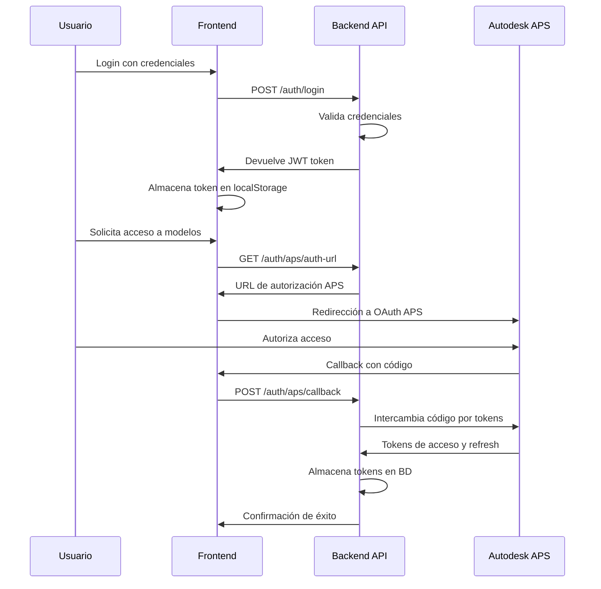
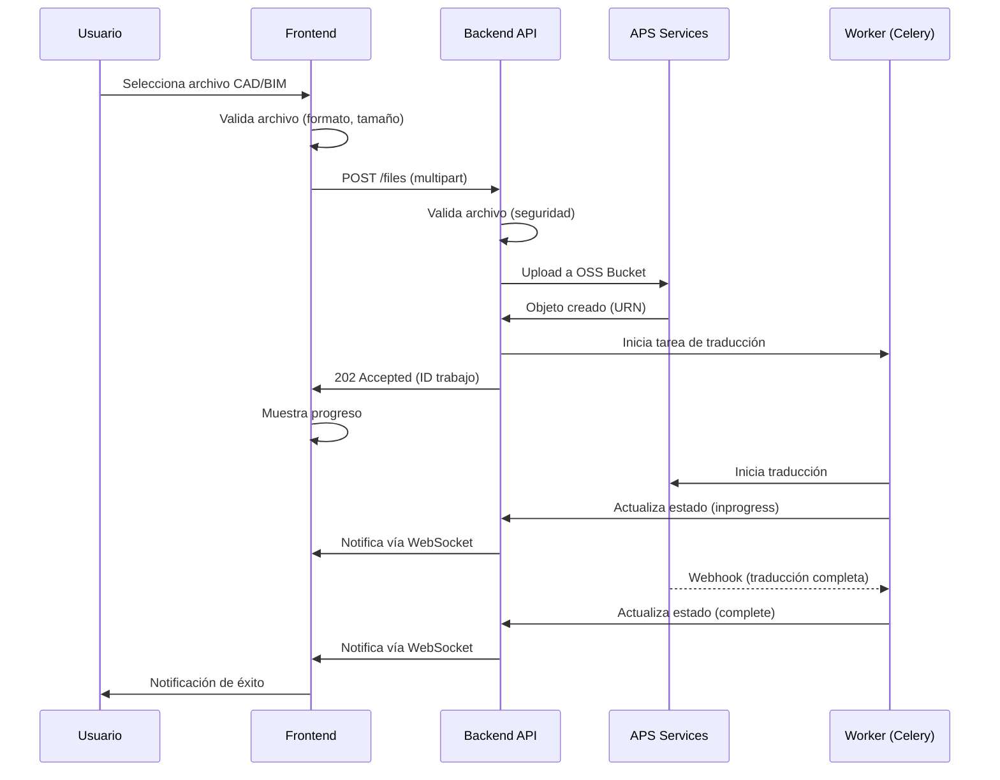
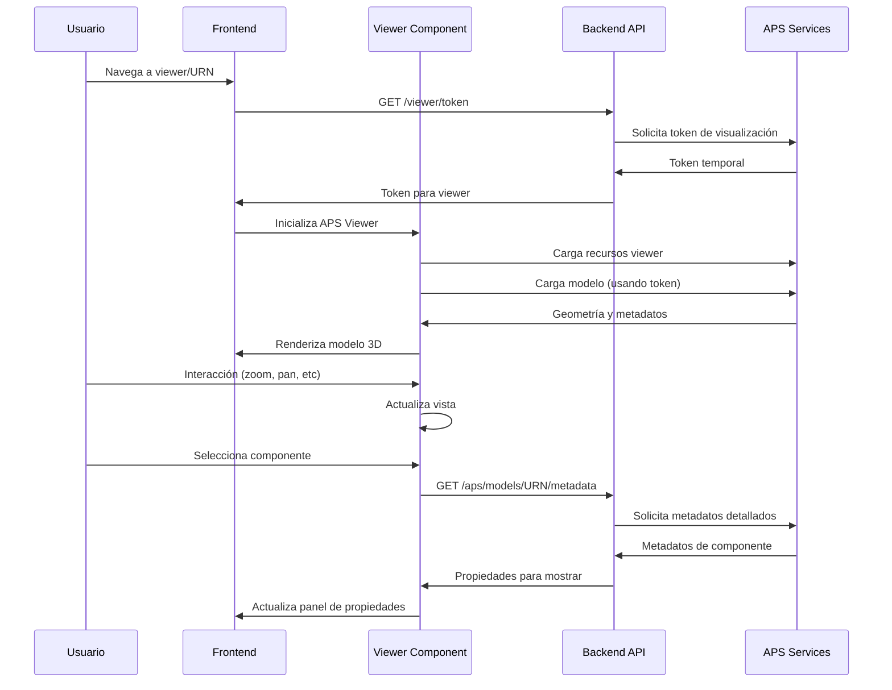
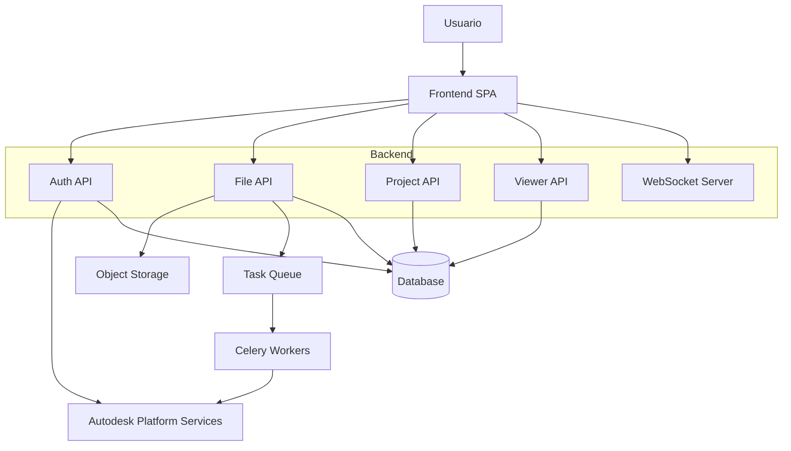
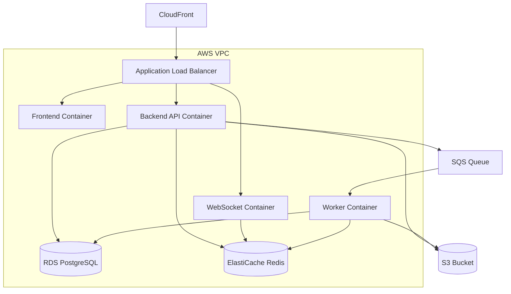

# Arquitectura del Sistema - Plataforma de Integración APS

## Visión General

La Plataforma de Integración APS se ha desarrollado siguiendo una arquitectura de microservicios moderna, escalable y resiliente. Este documento detalla los componentes clave, patrones de diseño y consideraciones técnicas que fundamentan el sistema.

## Índice de Contenidos

1. [Principios de Diseño](#principios-de-diseño)
2. [Arquitectura de Alto Nivel](#arquitectura-de-alto-nivel)
3. [Componentes del Sistema](#componentes-del-sistema)
4. [Flujos de Datos Clave](#flujos-de-datos-clave)
5. [Stack Tecnológico](#stack-tecnológico)
6. [Seguridad](#seguridad)
7. [Escalabilidad y Performance](#escalabilidad-y-performance)
8. [Monitoreo y Observabilidad](#monitoreo-y-observabilidad)
9. [Diagramas Técnicos](#diagramas-técnicos)

## Principios de Diseño

La arquitectura del sistema se fundamenta en los siguientes principios:

1. **Microservicios**: Componentes independientes y desacoplados que pueden desarrollarse, desplegarse y escalarse de forma autónoma.
2. **API-First**: Interfaces bien definidas para todas las funcionalidades, permitiendo integraciones externas.
3. **Escalabilidad Horizontal**: Capacidad de aumentar la capacidad añadiendo más instancias en lugar de aumentar los recursos de instancias existentes.
4. **Resilencia**: Tolerancia a fallos mediante redundancia, reintentos y circuit breakers.
5. **Seguridad por Diseño**: Implementación de controles de seguridad en todas las capas del sistema.
6. **Observabilidad**: Monitoreo completo con métricas, logs y trazas.
7. **DevOps**: Automatización de CI/CD y gestión de infraestructura como código.

## Arquitectura de Alto Nivel

```
┌─────────────────────────────────────────────────────────────────────┐
│                            USUARIOS FINALES                         │
└─────────────────────────┬───────────────────────────────────────────┘
                          │
┌─────────────────────────▼───────────────────────────────────────────┐
│                         CDN / CloudFront                            │
└─────────────────────────┬───────────────────────────────────────────┘
                          │
┌─────────────────────────▼───────────────────────────────────────────┐
│                    Application Load Balancer                        │
└─────────────────────────┬───────────────────────────────────────────┘
                          │
        ┌─────────────────┼─────────────────┐
        │                 │                 │
┌───────▼──────┐ ┌────────▼──────┐ ┌────────▼──────┐
│   Frontend   │ │   Backend     │ │   WebSocket   │
│  (React App) │ │  (FastAPI)    │ │   Gateway     │
└──────────────┘ └───────┬───────┘ └───────────────┘
                         │
        ┌────────────────┼────────────────┐
        │                │                │
┌───────▼──────┐ ┌───────▼───────┐ ┌──────▼──────┐
│   Database   │ │     Cache     │ │  Task Queue │
│ (PostgreSQL) │ │   (Redis)     │ │  (Celery)   │
└──────────────┘ └───────────────┘ └─────────────┘
                         │
┌────────────────────────▼────────────────────────┐
│                External Services                │
│  • Autodesk Platform Services (APS)            │
│  • AWS S3 (File Storage)                       │
│  • AWS SES (Email)                             │
│  • Monitoring & Logging                        │
└─────────────────────────────────────────────────┘
```

## Componentes del Sistema

### 1. Frontend Layer

El frontend es una Single Page Application (SPA) desarrollada con React y TypeScript que proporciona una interfaz de usuario moderna y responsive.

#### Componentes Clave
- **Layout y navegación**: Sistema de layout con sidebar responsive y navegación intuitiva
- **Componentes Viewer**: Integración con APS Viewer para visualización 3D interactiva
- **Gestión de Archivos**: Componentes para upload, procesamiento y gestión de archivos
- **Sistemas de Notificación**: WebSocket para actualizaciones en tiempo real
- **Panel de Administración**: Métricas y estadísticas del sistema

#### Estructura de Directorios Frontend
```
src/
├── components/        # Componentes React reutilizables
│   ├── viewer/        # Componentes de visualización 3D
│   ├── files/         # Gestión de archivos
│   ├── layout/        # Layout y navegación
│   ├── ui/            # Componentes UI base
│   └── ...
├── pages/             # Páginas principales
├── hooks/             # Hooks personalizados
├── services/          # Servicios de API
├── store/             # Redux store y slices
└── utils/             # Utilidades y helpers
```

### 2. Backend Layer

El backend está desarrollado con FastAPI (Python) y proporciona una API RESTful para todas las operaciones del sistema.

#### Servicios Principales
- **Authentication Service**: Gestión de autenticación con JWT y OAuth 2.0
- **File Management Service**: Upload, validación y procesamiento de archivos
- **APS Integration Service**: Integración con Autodesk Platform Services
- **Translation Service**: Conversión y traducción de modelos CAD/BIM
- **WebSocket Service**: Notificaciones en tiempo real y actualizaciones de estado

#### Estructura de Directorios Backend
```
app/
├── api/               # Endpoints de API
│   └── v1/            # Versión 1 de la API
├── core/              # Configuración central
├── models/            # Modelos de datos SQLAlchemy
├── schemas/           # Schemas Pydantic
├── services/          # Lógica de negocio
├── tasks/             # Tareas asíncronas (Celery)
└── middleware/        # Middleware personalizado
```

### 3. Data Layer

#### PostgreSQL Database
Base de datos relacional principal para almacenamiento persistente de:
- Usuarios y autenticación
- Proyectos y organización
- Archivos y metadatos
- Trabajos de traducción y estado

#### Redis Cache
Utilizado para:
- Almacenamiento de sesión
- Caché de respuestas API
- Cola de tareas para Celery
- Datos en tiempo real y WebSocket

### 4. Processing Layer

Sistema de procesamiento asíncrono basado en Celery para tareas de larga duración:
- Procesamiento de archivos
- Traducción de modelos CAD/BIM
- Extracción de metadatos
- Notificaciones por correo electrónico
- Tareas de mantenimiento

### 5. Infrastructure Layer

La infraestructura se gestiona mediante IaC (Infrastructure as Code) con Terraform:
- **Containerization**: Docker para empaquetado de aplicaciones
- **Orchestration**: AWS ECS Fargate para gestión de contenedores
- **Networking**: AWS VPC, ALB, Security Groups
- **Storage**: AWS S3 para archivos, RDS para PostgreSQL, ElastiCache para Redis
- **CDN**: CloudFront para distribución de contenido estático

## Flujos de Datos Clave

### 1. Autenticación y Autorización



### 2. Upload y Traducción de Modelos



### 3. Visualización 3D



## Stack Tecnológico

### Frontend Stack
```yaml
Core:
  - React 18
  - TypeScript 5
  - Vite 4
  - Tailwind CSS 3

State Management:
  - Redux Toolkit
  - React Query

UI/UX:
  - Headless UI
  - Heroicons
  - Framer Motion

Testing:
  - Vitest
  - Cypress
  - Testing Library
```

### Backend Stack
```yaml
Core:
  - Python 3.11
  - FastAPI 0.104
  - SQLAlchemy 2.0
  - Pydantic 2.0

Database:
  - PostgreSQL 15
  - Redis 7.x

Processing:
  - Celery 5.3
  - Flower

Security:
  - JWT tokens
  - bcrypt
  - python-jose

Testing:
  - pytest
  - pytest-asyncio
  - httpx
```

### Infrastructure Stack
```yaml
Containerization:
  - Docker
  - Docker Compose

Orchestration:
  - AWS ECS Fargate
  - AWS Application Load Balancer

Infrastructure as Code:
  - Terraform
  - AWS CloudFormation

CI/CD:
  - GitHub Actions
  - AWS CodePipeline

Monitoring:
  - Prometheus
  - Grafana
  - CloudWatch
```

## Seguridad

La plataforma implementa un enfoque de seguridad en capas:

### Autenticación y Autorización
- **JWT Tokens**: Para autenticación de usuarios con expiración y rotación
- **OAuth 2.0**: Integración con Autodesk APS para autorización delegada
- **RBAC**: Control de acceso basado en roles para permisos granulares
- **API Keys**: Para integraciones de terceros con alcance limitado

### Seguridad en Transmisión
- **TLS/SSL**: Toda la comunicación está cifrada en tránsito
- **Secure Headers**: Implementación de cabeceras de seguridad (HSTS, CSP, X-Content-Type-Options)
- **CORS**: Configuración restrictiva para prevenir ataques XSS

### Seguridad de Datos
- **Encryption at Rest**: Cifrado de datos sensibles en base de datos
- **Input Validation**: Validación estricta con Pydantic schemas
- **Output Encoding**: Prevención de XSS en respuestas API
- **Sanitization**: Limpieza de nombres de archivo y contenido

### Protección de la Infraestructura
- **WAF**: Protección contra ataques comunes (SQL Injection, XSS)
- **Rate Limiting**: Protección contra abusos y DoS
- **Network Security**: VPC privadas y segmentación de red
- **Secret Management**: Gestión segura de secretos con AWS Secrets Manager

## Escalabilidad y Performance

La arquitectura está diseñada para escalar horizontalmente:

### Estrategias de Escalabilidad
- **Stateless Services**: Los servicios no mantienen estado entre peticiones
- **Auto Scaling**: Configuración de escalado automático basado en métricas
- **Load Balancing**: Distribución de tráfico entre múltiples instancias
- **Database Scaling**: Read replicas y particionamiento para escalar bases de datos
- **Caching**: Implementación de caché en múltiples niveles (API, database)

### Optimizaciones de Performance
- **Connection Pooling**: Reutilización de conexiones a bases de datos
- **Lazy Loading**: Carga diferida de recursos pesados
- **Chunked Processing**: Procesamiento en chunks para archivos grandes
- **CDN**: Distribución de contenido estático cerca de los usuarios
- **Compression**: Compresión de respuestas HTTP (gzip, brotli)

## Monitoreo y Observabilidad

El sistema implementa un enfoque completo de observabilidad:

### Logging
- **Structured Logging**: Logs en formato JSON con campos estandarizados
- **Centralized Logs**: Agregación centralizada con CloudWatch Logs
- **Log Levels**: Niveles configurables por ambiente

### Métricas
- **System Metrics**: CPU, memoria, disco, red
- **Application Metrics**: Latencia, throughput, errores
- **Business Metrics**: Uploads, traducciones, visualizaciones
- **Custom Dashboards**: Paneles Grafana para diferentes stakeholders

### Alerting
- **Threshold Alerts**: Alertas basadas en umbrales predefinidos
- **Anomaly Detection**: Detección de patrones anómalos
- **Paging**: Integración con sistemas de guardia (PagerDuty)
- **Runbooks**: Procedimientos documentados para respuesta a incidentes

## Diagramas Técnicos

### Diagrama de Componentes


### Diagrama de Despliegue


## Recursos Adicionales

- [Diagrama Detallado de Infraestructura](./infra-diagram.md)
- [Modelo de Datos Completo](./database-model.md)
- [Estrategia de Seguridad](./security-strategy.md)
- [Plan de Escalabilidad](./scalability-plan.md)