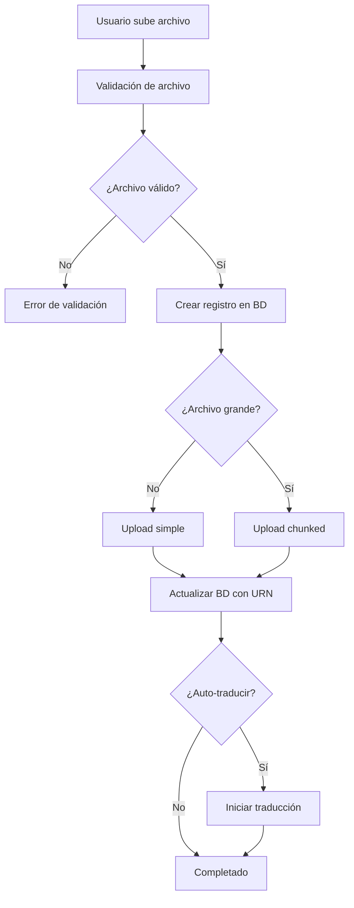
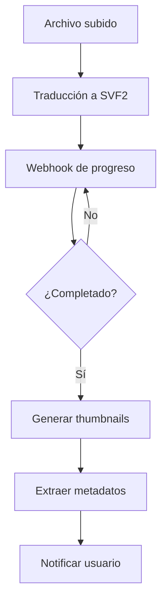
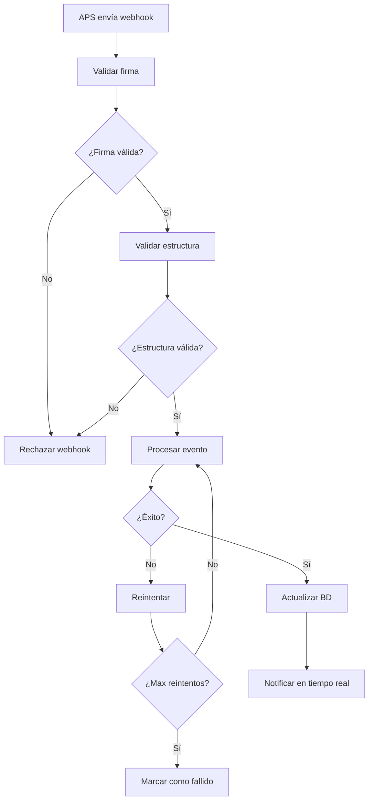

# 📁 Sistema de Gestión de Archivos - APS Integration

Documentación completa del sistema avanzado de gestión de archivos con integración APS.

## 🚀 Características Principales

### 📤 Upload Avanzado
- **Chunked Upload**: Archivos grandes (>5MB) se dividen en chunks para upload resiliente
- **Upload Resumible**: Capacidad de reanudar uploads interrumpidos
- **Validación Completa**: Validación de tipo MIME, tamaño, seguridad y cuota
- **Progreso en Tiempo Real**: Tracking detallado del progreso de upload

### 🔒 Seguridad de Archivos
- **Validación de Tipos**: Solo archivos CAD/BIM y formatos seguros permitidos
- **Escaneo de Seguridad**: Detección de patrones maliciosos y validación de contenido
- **Sanitización**: Nombres de archivo y metadatos sanitizados automáticamente
- **Cuotas de Usuario**: Límites configurables por usuario y proyecto

### 🔄 Procesamiento Automático
- **Traducción Automática**: Conversión automática a formatos visualizables (SVF2)
- **Generación de Thumbnails**: Previsualizaciones en múltiples tamaños
- **Extracción de Metadatos**: Información detallada del modelo extraída automáticamente
- **Monitoreo de Progreso**: Seguimiento en tiempo real de todas las tareas

### 🔗 Sistema de Webhooks
- **Notificaciones APS**: Recepción automática de eventos de traducción
- **Retry Logic**: Reintentos automáticos con backoff exponencial
- **Validación de Firma**: Verificación de autenticidad de webhooks
- **Notificaciones en Tiempo Real**: Comunicación instantánea de cambios de estado

## 📋 Tipos de Archivo Soportados

### 🏗️ CAD/BIM
```
.rvt, .rfa, .rte    # Revit
.dwg, .dxf          # AutoCAD
.ifc                # Industry Foundation Classes
.nwd, .nwf, .nwc    # Navisworks
.skp                # SketchUp
.3dm                # Rhino 3D
```

### 🎨 3D y Diseño
```
.3ds, .max          # 3ds Max
.fbx, .obj, .dae    # Formatos 3D generales
.3mf, .stl          # Impresión 3D
.sat, .step, .stp   # CAD estándar
.iges, .igs         # CAD intercambio
```

### 📊 Nubes de Puntos
```
.pts, .xyz          # Formatos de texto
.las, .laz          # LIDAR comprimido
```

### 📄 Documentos e Imágenes
```
.pdf                # Documentos PDF
.jpg, .png          # Imágenes
```

## 🔧 API Endpoints

### 📤 Upload de Archivos

#### `POST /api/v1/files/upload`
Upload avanzado con validación completa y procesamiento automático.

**Parámetros:**
- `file`: Archivo a subir (multipart/form-data)
- `project_id`: ID del proyecto (form field)
- `metadata`: Metadatos adicionales en JSON (opcional)
- `auto_translate`: Iniciar traducción automática (default: true)

**Respuesta:**
```json
{
  "id": 123,
  "upload_id": "uuid-string",
  "filename": "modelo.rvt",
  "original_filename": "Modelo Arquitectónico.rvt",
  "urn": "encoded-urn",
  "size": 15728640,
  "status": "uploaded",
  "project_id": 1,
  "uploaded_at": "2024-01-15T14:30:00Z",
  "object_key": "safe_filename.rvt",
  "bucket_key": "project-bucket",
  "metadata": {}
}
```

#### `GET /api/v1/files/upload/{upload_id}/progress`
Obtener progreso de upload en tiempo real.

**Respuesta:**
```json
{
  "file_id": "upload-id",
  "total_size": 15728640,
  "uploaded_bytes": 7864320,
  "progress_percentage": 50.0,
  "current_part": 2,
  "total_parts": 4,
  "status": "uploading",
  "upload_speed_mbps": 2.5,
  "elapsed_seconds": 30
}
```

### 📋 Gestión de Archivos

#### `GET /api/v1/files/`
Listar archivos con filtros avanzados.

**Parámetros de Query:**
- `project_id`: Filtrar por proyecto
- `status`: Filtrar por estado (uploaded, translating, ready, error)
- `search`: Buscar en nombre de archivo
- `limit`: Límite de resultados (1-100, default: 20)
- `offset`: Offset para paginación

#### `GET /api/v1/files/{file_id}`
Obtener detalles completos de archivo.

#### `GET /api/v1/files/{file_id}/download`
Generar URL firmada para descarga directa.

#### `POST /api/v1/files/{file_id}/share`
Crear enlace compartido con configuración de acceso.

#### `GET /api/v1/files/{file_id}/metadata`
Obtener metadatos detallados.

#### `PUT /api/v1/files/{file_id}/metadata`
Actualizar metadatos del archivo.

#### `DELETE /api/v1/files/{file_id}`
Eliminar archivo completamente (BD + APS).

### 🔄 Procesamiento

#### `POST /api/v1/files/{file_id}/translate`
Iniciar traducción manual.

#### `POST /api/v1/files/{file_id}/thumbnails`
Generar thumbnails en tamaños específicos.

## 🔧 Configuración

### Variables de Entorno Principales

```env
# Tamaños y límites
MAX_FILE_SIZE=524288000          # 500MB
CHUNK_SIZE=5242880               # 5MB chunks
DEFAULT_USER_QUOTA=5368709120    # 5GB por usuario

# Procesamiento automático
AUTO_TRANSLATE_ON_UPLOAD=true
AUTO_GENERATE_THUMBNAILS=true
AUTO_EXTRACT_METADATA=true

# Webhooks
WEBHOOK_SECRET=your_secret_here
WEBHOOK_MAX_RETRIES=3
WEBHOOK_TIMEOUT=30

# Rate limiting
RATE_LIMIT_PER_MINUTE=100
RATE_LIMIT_BURST=200
```

### Extensiones Permitidas
Se configura en `ALLOWED_EXTENSIONS`:
```env
ALLOWED_EXTENSIONS=.rvt,.dwg,.ifc,.3dm,.skp,.fbx,.obj,.pdf,.jpg,.png
```

## 🔄 Flujo de Procesamiento

### 1. Upload de Archivo


### 2. Procesamiento Automático


### 3. Sistema de Webhooks


## 🛡️ Seguridad

### Validación de Archivos
1. **Extensión**: Verificación contra lista blanca
2. **MIME Type**: Detección real del tipo de archivo
3. **Tamaño**: Límites por archivo y cuota global
4. **Contenido**: Escaneo de patrones maliciosos
5. **Entropía**: Detección de archivos cifrados/comprimidos

### Sanitización
- **Nombres**: Caracteres peligrosos removidos
- **Metadatos**: Campos validados y limitados
- **URNs**: Generación segura para objetos APS

### Rate Limiting
- **Por usuario**: 100 peticiones/minuto
- **Burst**: Hasta 200 peticiones en ráfaga
- **Por IP**: Límites adicionales por dirección

## 📊 Monitoreo

### Métricas Disponibles
- Archivos subidos por día/hora
- Tiempo promedio de traducción
- Tasa de éxito/fallo
- Uso de cuota por usuario
- Performance de webhooks

### Logs Estructurados
```json
{
  "timestamp": "2024-01-15T14:30:00Z",
  "level": "info",
  "message": "Archivo subido exitosamente",
  "user_id": 123,
  "file_id": 456,
  "filename": "modelo.rvt",
  "size_mb": 15.7,
  "upload_duration_ms": 2500
}
```

## 🔄 Estados de Archivo

### Estados Principales
- **`uploading`**: Upload en progreso
- **`uploaded`**: Upload completado, pendiente de procesamiento
- **`translating`**: Traducción en progreso
- **`ready`**: Listo para visualización
- **`error`**: Error en procesamiento

### Transiciones de Estado
```
uploading → uploaded → translating → ready
    ↓           ↓           ↓         
  error ←--- error ←--- error
```

## 🚀 Optimizaciones de Performance

### Upload
- **Chunked Upload**: Archivos >5MB divididos en chunks
- **Compresión**: Datos comprimidos en tránsito
- **CDN**: Distribución global de contenido
- **Connection Pooling**: Reutilización de conexiones

### Procesamiento
- **Queue Asíncrono**: Celery con Redis
- **Paralelización**: Múltiples workers
- **Cache**: Redis para metadatos y tokens
- **Batch Processing**: Operaciones agrupadas

### Base de Datos
- **Índices**: Optimizados para consultas frecuentes
- **Connection Pool**: Pool de conexiones PostgreSQL
- **Paginación**: Lazy loading para listas grandes

## 🧪 Testing

### Pruebas Unitarias
```bash
# Ejecutar pruebas de gestión de archivos
pytest tests/test_file_manager.py -v

# Pruebas de webhooks
pytest tests/test_webhook_handler.py -v

# Pruebas de procesamiento
pytest tests/test_file_processing.py -v

# Todas las pruebas con cobertura
python run_tests.py
```

### Casos de Prueba Cubiertos
- ✅ Upload de archivos (exitoso/fallido)
- ✅ Validación de archivos
- ✅ Chunked upload
- ✅ Progreso de upload
- ✅ Webhooks (firma, estructura, procesamiento)
- ✅ Traducción automática
- ✅ Generación de thumbnails
- ✅ Extracción de metadatos
- ✅ Reintentos y manejo de errores

## 🐛 Troubleshooting

### Problemas Comunes

#### Upload Falla
```bash
# Verificar logs
docker logs backend_container | grep upload

# Verificar espacio en disco
df -h

# Verificar permisos
ls -la /path/to/upload/folder
```

#### Traducción No Inicia
```bash
# Verificar tokens APS
curl -X POST http://localhost:8000/api/v1/auth/token

# Verificar webhooks
curl http://localhost:8000/api/v1/webhooks/status

# Verificar cola de Celery
celery -A app.tasks inspect active
```

#### Webhooks No Llegan
```bash
# Verificar configuración
echo $WEBHOOK_SECRET

# Verificar logs de webhooks
tail -f logs/webhook.log

# Test manual de webhook
curl -X POST http://localhost:8000/api/v1/webhooks/test \
  -H "Content-Type: application/json" \
  -d '{"EventType":"test"}'
```

## 📈 Roadmap

### Funcionalidades Futuras
- [ ] **Versionado de Archivos**: Historial de versiones
- [ ] **Colaboración**: Comentarios y anotaciones
- [ ] **Integración CAD**: Plugins para software CAD
- [ ] **IA/ML**: Clasificación automática de modelos
- [ ] **Renderizado**: Renders automáticos de alta calidad
- [ ] **Comparación**: Diff entre versiones de modelos
- [ ] **Backup**: Backup automático a múltiples clouds

### Optimizaciones Planeadas
- [ ] **Edge Computing**: Procesamiento distribuido
- [ ] **GraphQL**: API más flexible
- [ ] **WebRTC**: Transferencia P2P de archivos grandes
- [ ] **WASM**: Validación de archivos en el browser

---

**Desarrollado con ❤️ para la industria AEC**
