# 🔄 Sistema de Traducción de Modelos APS

Documentación completa del sistema avanzado de traducción de modelos CAD/BIM utilizando APS Model Derivative API.

## 🚀 Características Principales

### 📤 Traducción Automática Avanzada
- **Múltiples Formatos**: Soporte para SVF, SVF2, Thumbnail, STL, OBJ, GLTF, STEP, IGES
- **Configuración Flexible**: Configuraciones personalizadas por tipo de archivo y disciplina
- **Calidad Ajustable**: Niveles de calidad Low, Medium, High con configuraciones específicas
- **Procesamiento Asíncrono**: Monitoreo en tiempo real con polling inteligente

### 🔒 Gestión Segura de URNs
- **Validación Completa**: Validación exhaustiva de URNs con patrones específicos
- **Encriptación**: Almacenamiento seguro con encriptación AES
- **URNs Firmados**: Generación de URNs con firma HMAC y expiración
- **Codificación Base64**: Codificación segura para uso en URLs

### 📊 Extracción Completa de Metadatos
- **Metadatos Estructurados**: Extracción automática de geometría, materiales y propiedades
- **Análisis de Disciplinas**: Clasificación automática por Architecture, Structure, MEP, Civil
- **Jerarquía de Objetos**: Análisis completo de la estructura del modelo
- **Métricas de Calidad**: Puntuación de calidad, completitud y organización

### 🔄 Sistema de Monitoreo Inteligente
- **Polling Adaptativo**: Intervalos inteligentes con jitter para evitar rate limits
- **Reintentos Automáticos**: Backoff exponencial para fallos temporales
- **Circuit Breaker**: Protección contra fallos repetidos
- **Métricas de Performance**: Tracking completo de tiempos y eficiencia

## 📋 Tipos de Archivo Soportados

### 🏗️ CAD/BIM Principales
```
.rvt, .rfa, .rte    # Autodesk Revit
.ifc                # Industry Foundation Classes
.dwg, .dxf          # AutoCAD
.3dm                # Rhino 3D
.skp                # SketchUp
.nwd, .nwf, .nwc    # Navisworks
```

### 🎨 Formatos 3D Adicionales
```
.3ds, .max          # 3ds Max
.fbx, .obj, .dae    # Formatos 3D estándar
.step, .stp         # CAD estándar
.iges, .igs         # CAD intercambio
.stl, .3mf          # Impresión 3D
```

### 📊 Formatos de Salida
```
SVF                 # Simple Vector Format (legacy)
SVF2                # Simple Vector Format 2 (optimizado)
Thumbnail           # Imágenes de previsualización
STL                 # Stereolithography
OBJ                 # Wavefront OBJ
GLTF                # GL Transmission Format
STEP                # Standard for Exchange of Product Data
IGES                # Initial Graphics Exchange Specification
```

## 🔧 Configuraciones de Traducción

### Niveles de Calidad

#### 🔹 Low (Rápido)
```json
{
  "svf2": {
    "compressionLevel": 9,
    "generateMasterViews": false
  },
  "thumbnail": {
    "width": 100,
    "height": 100
  }
}
```

#### 🔸 Medium (Balanceado)
```json
{
  "svf2": {
    "compressionLevel": 6,
    "generateMasterViews": true
  },
  "thumbnail": {
    "width": 200,
    "height": 200
  }
}
```

#### 🔺 High (Máxima Calidad)
```json
{
  "svf2": {
    "compressionLevel": 3,
    "generateMasterViews": true,
    "materialProperties": true,
    "buildingStoreys": true
  },
  "thumbnail": {
    "width": 400,
    "height": 400
  }
}
```

### Configuraciones por Formato

#### 🏢 Revit (.rvt)
```json
{
  "default_outputs": ["svf2", "thumbnail"],
  "advanced_options": {
    "generateMasterViews": true,
    "buildingStoreys": true,
    "spaces": true,
    "materialProperties": true
  },
  "estimated_time": 300,
  "timeout": 1800
}
```

#### 🏗️ IFC
```json
{
  "default_outputs": ["svf2", "thumbnail"],
  "advanced_options": {
    "generateMasterViews": true,
    "materialProperties": true,
    "openingElements": true
  },
  "estimated_time": 240,
  "timeout": 1500
}
```

#### 📐 AutoCAD (.dwg)
```json
{
  "default_outputs": ["svf", "thumbnail"],
  "advanced_options": {
    "generateMasterViews": false,
    "2dviews": true,
    "extractThumbnail": true
  },
  "estimated_time": 120,
  "timeout": 900
}
```

## 🛠️ API Endpoints

### 📤 Iniciar Traducción

#### `POST /api/v1/translate`
Iniciar nueva traducción de modelo con configuración personalizada.

**Request Body:**
```json
{
  "file_id": 123,
  "output_formats": ["svf2", "thumbnail"],
  "quality_level": "medium",
  "priority": "normal",
  "config_name": "Revit Standard",
  "custom_config": {
    "svf2": {
      "generateMasterViews": true,
      "compressionLevel": 5
    }
  },
  "auto_extract_metadata": true,
  "generate_thumbnails": true
}
```

**Response:**
```json
{
  "success": true,
  "job_id": "urn:adsk.viewing:fs.file:encoded_urn",
  "internal_id": "uuid-string",
  "status": "pending",
  "message": "Traducción iniciada exitosamente",
  "estimated_duration": 300,
  "polling_url": "/api/v1/translate/{job_id}/status",
  "manifest_url": "/api/v1/translate/{job_id}/manifest",
  "metadata_url": "/api/v1/translate/{job_id}/metadata"
}
```

### 📊 Monitoreo de Estado

#### `GET /api/v1/translate/{job_id}/status`
Obtener estado actual de traducción con progreso detallado.

**Response:**
```json
{
  "job_id": "job-id-123",
  "status": "inprogress",
  "progress": 75.5,
  "progress_message": "Procesando geometría...",
  "current_step": "geometry_processing",
  "estimated_time_remaining": 120,
  "last_updated": "2024-01-15T14:30:00Z",
  "warnings": []
}
```

#### Estados Posibles:
- `pending`: En cola, esperando procesamiento
- `inprogress`: Traducción en progreso
- `success`: Completado exitosamente
- `failed`: Falló la traducción
- `timeout`: Expiró por timeout
- `cancelled`: Cancelado por usuario

### 📋 Obtener Manifest

#### `GET /api/v1/translate/{job_id}/manifest`
Obtener manifest completo del modelo traducido.

**Response:**
```json
{
  "job_id": "job-id-123",
  "type": "manifest",
  "region": "US",
  "version": "1.0",
  "status": "success",
  "progress": "100%",
  "derivatives": [
    {
      "name": "modelo.rvt",
      "status": "success",
      "progress": "100%",
      "output_type": "svf2",
      "size": 15728640,
      "mime": "application/autodesk-svf2",
      "children": [
        {
          "type": "resource",
          "role": "graphics",
          "guid": "model-guid-123",
          "urn": "derivative-urn"
        }
      ]
    }
  ],
  "thumbnails": [
    {
      "urn": "thumbnail-urn",
      "resolution": [400, 400],
      "mime": "image/png"
    }
  ],
  "warnings": []
}
```

### 📊 Metadatos Extraídos

#### `GET /api/v1/translate/{job_id}/metadata`
Obtener metadatos completos extraídos del modelo.

**Query Parameters:**
- `extract_fresh`: `true/false` - Extraer metadatos nuevamente

**Response:**
```json
{
  "extraction_timestamp": "2024-01-15T14:30:00Z",
  "source_info": {
    "type": "manifest",
    "status": "success",
    "derivatives_count": 2
  },
  "model_info": {
    "name": "Edificio Oficinas",
    "created_by": "Arquitecto Principal",
    "application": "Autodesk Revit 2024",
    "file_size": 15728640
  },
  "geometry_info": {
    "has_geometry": true,
    "geometry_types": ["svf2"],
    "file_size_bytes": 8945632,
    "compression_used": true
  },
  "hierarchy_info": {
    "total_nodes": 1250,
    "max_depth": 8,
    "leaf_nodes": 847,
    "intermediate_nodes": 403
  },
  "categories_analysis": {
    "categories": {
      "Walls": 156,
      "Doors": 48,
      "Windows": 72,
      "Floors": 24,
      "Roofs": 12
    },
    "category_count": 5,
    "largest_category": ["Walls", 156]
  },
  "discipline_analysis": {
    "primary_discipline": "Architecture",
    "disciplines": {
      "Architecture": 312,
      "Structure": 89,
      "MEP": 156
    },
    "discipline_count": 3
  },
  "quality_metrics": {
    "overall_quality_score": 0.85,
    "completeness_score": 0.9,
    "consistency_score": 0.8,
    "detail_level_score": 0.85,
    "organization_score": 0.8
  },
  "statistics": {
    "element_count": 1250,
    "property_count": 15000,
    "avg_properties_per_element": 12.0,
    "unique_categories": 25,
    "file_complexity_score": 0.7
  },
  "recommendations": [
    "Modelo bien organizado con jerarquía clara",
    "Considerar agregar más propiedades MEP",
    "Excelente nivel de detalle arquitectónico"
  ]
}
```

### 🌳 Jerarquía de Objetos

#### `GET /api/v1/translate/{job_id}/hierarchy`
Obtener estructura jerárquica completa del modelo.

**Response:**
```json
{
  "data": {
    "type": "object",
    "objects": [
      {
        "objectid": 1,
        "name": "Revit Model",
        "objects": [
          {
            "objectid": 2,
            "name": "Architecture",
            "objects": [
              {
                "objectid": 3,
                "name": "Walls",
                "objects": [
                  {
                    "objectid": 100,
                    "name": "Basic Wall: Exterior Wall",
                    "objects": []
                  }
                ]
              }
            ]
          }
        ]
      }
    ]
  }
}
```

### 🔄 Gestión de Traducciones

#### `POST /api/v1/translate/{job_id}/retry`
Reintentar traducción fallida.

**Request Body:**
```json
{
  "reset_retry_count": false,
  "new_config": {
    "svf2": {
      "compressionLevel": 8
    }
  }
}
```

#### `DELETE /api/v1/translate/{job_id}`
Cancelar traducción en progreso.

**Request Body:**
```json
{
  "reason": "Usuario canceló la operación",
  "delete_manifest": true
}
```

### 📈 Métricas y Estadísticas

#### `GET /api/v1/translate/{job_id}/metrics`
Obtener métricas detalladas de performance.

**Response:**
```json
{
  "job_id": "job-id-123",
  "queue_time": 45,
  "processing_time": 285,
  "total_time": 330,
  "geometry_quality": 0.9,
  "input_file_size": 15728640,
  "output_file_size": 8945632,
  "compression_ratio": 0.57,
  "vertex_count": 125000,
  "face_count": 89000,
  "object_count": 1250,
  "warnings_count": 2,
  "errors_count": 0,
  "overall_quality_score": 0.85,
  "efficiency_score": 0.78,
  "measured_at": "2024-01-15T14:30:00Z"
}
```

#### `GET /api/v1/translate/stats/overview`
Estadísticas generales del usuario.

**Query Parameters:**
- `days`: Número de días para estadísticas (1-365, default: 30)

**Response:**
```json
{
  "total_translations": 45,
  "successful_translations": 38,
  "failed_translations": 5,
  "pending_translations": 2,
  "success_rate": 84.4,
  "avg_processing_time": 245.6,
  "avg_queue_time": 32.1,
  "popular_formats": {
    "svf2": 35,
    "thumbnail": 40,
    "stl": 8
  },
  "translations_by_day": {
    "2024-01-15": 3,
    "2024-01-14": 5,
    "2024-01-13": 2
  },
  "translations_by_status": {
    "success": 38,
    "failed": 5,
    "pending": 2,
    "cancelled": 0
  }
}
```

### 🔧 Configuración del Sistema

#### `GET /api/v1/translate/formats/supported`
Obtener formatos de entrada y salida soportados.

**Response:**
```json
{
  "input_formats": [
    "dwg", "dxf", "rvt", "ifc", "3dm", "skp", "step", "iges"
  ],
  "output_formats": [
    "svf", "svf2", "thumbnail", "stl", "obj", "gltf"
  ],
  "format_details": {
    "svf2": {
      "name": "SVF2 (Simple Vector Format 2)",
      "description": "Formato optimizado para visualización",
      "supports_2d": true,
      "supports_3d": true,
      "file_size": "Small"
    }
  },
  "last_updated": "2024-01-15T14:30:00Z"
}
```

## 🔄 Flujos de Trabajo

### 1. Flujo de Traducción Básica

```mermaid
graph TD
    A[Usuario sube archivo] --> B[Archivo almacenado con URN]
    B --> C[POST /translate con file_id]
    C --> D[Validar archivo y permisos]
    D --> E[Crear TranslationJob]
    E --> F[Iniciar traducción en APS]
    F --> G[Polling automático de estado]
    G --> H{¿Completado?}
    H -->|No| G
    H -->|Sí| I[Extraer manifest y metadatos]
    I --> J[Notificar usuario]
    J --> K[Archivo listo para visualización]
```



### 2. Flujo de Monitoreo en Tiempo Real

```mermaid
graph TD
    A[Traducción iniciada] --> B[Crear tarea de monitoreo]
    B --> C[Polling cada N segundos]
    C --> D[Consultar estado en APS]
    D --> E[Actualizar progreso en BD]
    E --> F{¿Estado cambió?}
    F -->|Sí| G[Notificar via WebSocket]
    F -->|No| H{¿Completado?}
    G --> H
    H -->|No| I[Esperar con jitter]
    I --> C
    H -->|Sí| J[Procesar resultados]
    J --> K[Finalizar monitoreo]
```



### 3. Flujo de Extracción de Metadatos

```mermaid
graph TD
    A[Traducción exitosa] --> B[Obtener manifest]
    B --> C[Extraer GUID del modelo]
    C --> D[Consultar metadatos básicos]
    D --> E[Obtener árbol de objetos]
    E --> F[Extraer propiedades en bulk]
    F --> G[Analizar geometría]
    G --> H[Clasificar por disciplinas]
    H --> I[Calcular métricas de calidad]
    I --> J[Generar recomendaciones]
    J --> K[Guardar metadatos completos]
```



### 4. Flujo de Manejo de Errores


## 🧪 Testing

### Ejecutar Pruebas

```bash
# Pruebas específicas de traducción
pytest tests/test_translation_services.py -v

# Pruebas de URN Manager
pytest tests/test_translation_services.py::TestURNManager -v

# Pruebas de Model Derivative
pytest tests/test_translation_services.py::TestModelDerivativeService -v

# Pruebas de Metadata Extractor
pytest tests/test_translation_services.py::TestMetadataExtractor -v

# Pruebas de Translation Manager
pytest tests/test_translation_services.py::TestTranslationManager -v

# Prueba de integración completa
pytest tests/test_translation_services.py::test_integration_translation_flow -v
```

### Casos de Prueba Cubiertos

#### ✅ URN Manager
- Validación de URNs válidos e inválidos
- Codificación/decodificación Base64
- Encriptación/desencriptación AES
- Generación de URNs de objeto
- URNs firmados con HMAC
- Extracción de componentes

#### ✅ Model Derivative Service
- Inicio de traducción exitoso/fallido
- Consulta de estado en diferentes fases
- Obtención de manifest
- Construcción de payload de traducción
- Configuración por formato de archivo
- Manejo de errores HTTP

#### ✅ Metadata Extractor
- Extracción completa de metadatos
- Análisis de jerarquía de objetos
- Mapeo de categorías a disciplinas
- Cálculo de métricas de calidad
- Generación de recomendaciones
- Procesamiento de manifest

#### ✅ Translation Manager
- Inicio de traducción con validaciones
- Manejo de traducciones activas existentes
- Cancelación de trabajos
- Reintentos con backoff
- Monitoreo asíncrono
- Gestión de estado persistente

## ⚙️ Configuración

### Variables de Entorno

```env
# APS Model Derivative API
APS_CLIENT_ID=your_client_id
APS_CLIENT_SECRET=your_client_secret
APS_CALLBACK_URL=http://localhost:8000/api/v1/auth/aps/callback

# Configuración de traducción
MAX_TRANSLATION_TIME=3600          # Tiempo máximo por traducción (segundos)
DEFAULT_POLLING_INTERVAL=30        # Intervalo de polling por defecto
MAX_CONCURRENT_TRANSLATIONS=10     # Traducciones concurrentes máximas
TRANSLATION_RETRY_DELAY=60         # Delay entre reintentos (segundos)

# Configuración de calidad
DEFAULT_QUALITY_LEVEL=medium       # Nivel de calidad por defecto
ENABLE_AUTO_METADATA=true          # Extraer metadatos automáticamente
ENABLE_AUTO_THUMBNAILS=true        # Generar thumbnails automáticamente

# Cache y optimización
METADATA_CACHE_TTL=3600            # TTL de cache de metadatos (segundos)
URN_ENCRYPTION_ENABLED=true        # Habilitar encriptación de URNs
MANIFEST_CACHE_ENABLED=true        # Habilitar cache de manifests
```

### Configuraciones Avanzadas

#### Timeout por Tipo de Archivo
```python
TIMEOUT_BY_EXTENSION = {
    '.rvt': 1800,  # 30 minutos
    '.ifc': 1500,  # 25 minutos
    '.dwg': 900,   # 15 minutos
    '.3dm': 1200,  # 20 minutos
    'default': 1800
}
```

#### Configuración de Polling Inteligente
```python
POLLING_CONFIG = {
    'initial_interval': 15,        # Segundos
    'max_interval': 120,           # Segundos
    'backoff_multiplier': 1.5,     # Factor de incremento
    'jitter_range': 0.2,           # ±20% jitter
    'circuit_breaker_threshold': 5 # Fallos consecutivos para circuit breaker
}
```

## 🚀 Optimizaciones de Performance

### Estrategias de Optimización

#### 1. Polling Inteligente
- **Intervalo Adaptativo**: Incrementa automáticamente con el tiempo
- **Jitter Aleatorio**: Evita thundering herd en múltiples traducciones
- **Circuit Breaker**: Desactiva polling temporal en fallos repetidos
- **Connection Pooling**: Reutilización de conexiones HTTP

#### 2. Cache Multinivel
- **Cache de Manifests**: Redis con TTL de 1 hora
- **Cache de Metadatos**: Persistente en BD + cache en memoria
- **Cache de URNs**: Encriptados en Redis con expiración
- **Cache de Configuraciones**: En memoria con invalidación automática

#### 3. Procesamiento Asíncrono
- **Queue de Traducciones**: Celery con Redis backend
- **Priorización**: Queue separada para trabajos urgentes
- **Batch Processing**: Agrupación de operaciones de BD
- **Background Cleanup**: Limpieza automática de datos antiguos

#### 4. Optimización de Red
- **Compresión**: Gzip para todas las respuestas de API
- **HTTP/2**: Multiplexing de conexiones
- **CDN**: Cache de assets estáticos
- **Rate Limiting**: Protección contra abuso

### Métricas de Performance

#### Targets de SLA
- **Tiempo de Inicio**: < 5 segundos
- **Polling Response**: < 2 segundos
- **Metadata Extraction**: < 30 segundos
- **API Response Time**: < 500ms (95th percentile)

#### Monitoring
- **Translation Success Rate**: > 95%
- **Average Processing Time**: Per file type
- **Queue Depth**: Número de trabajos pendientes
- **Error Rate**: Por tipo de error

## 🛡️ Seguridad

### Protección de URNs

#### Encriptación
```python
# URNs se encriptan antes de almacenamiento
encrypted_urn = urn_manager.encrypt_urn(original_urn)

# Se desencriptan solo cuando se necesitan
original_urn = urn_manager.decrypt_urn(encrypted_urn)
```

#### URNs Firmados
```python
# Creación de URN firmado con expiración
signed_urn = urn_manager.create_signed_urn(
    urn=original_urn,
    expires_in=3600  # 1 hora
)

# Verificación automática de firma y expiración
original_urn, is_valid = urn_manager.verify_signed_urn(signed_urn)
```

### Validación de Entrada

#### Validación de Archivos
- Solo archivos con extensiones permitidas
- Verificación de URN válido antes de traducción
- Validación de permisos de usuario
- Rate limiting por usuario y IP

#### Sanitización
- URNs sanitizados y validados
- Nombres de archivo limpiados
- Configuraciones validadas contra schema
- Escape de caracteres especiales

### Auditoría

#### Logs Estructurados
```json
{
  "timestamp": "2024-01-15T14:30:00Z",
  "level": "info",
  "event": "translation_started",
  "user_id": 123,
  "file_id": 456,
  "job_id": "translation-job-789",
  "output_formats": ["svf2", "thumbnail"],
  "estimated_duration": 300
}
```

#### Tracking de Operaciones
- Todas las traducciones registradas
- Estados y cambios auditados
- Accesos a metadatos loggeados
- Errores y reintentos tracked

## 🐛 Troubleshooting

### Problemas Comunes

#### Traducción No Inicia
```bash
# Verificar credenciales APS
curl -X POST "https://developer.api.autodesk.com/authentication/v1/authenticate" \
  -H "Content-Type: application/x-www-form-urlencoded" \
  -d "client_id=${APS_CLIENT_ID}&client_secret=${APS_CLIENT_SECRET}&grant_type=client_credentials&scope=data:read"

# Verificar formato de URN
python -c "
from app.services.urn_manager import urn_manager
try:
    urn_manager.validate_urn('your-urn-here')
    print('URN válido')
except Exception as e:
    print(f'URN inválido: {e}')
"

# Verificar estado del trabajo
curl -H "Authorization: Bearer $TOKEN" \
  "http://localhost:8000/api/v1/translate/{job_id}/status"
```

#### Traducción Se Queda en Pending
```bash
# Verificar logs de polling
tail -f logs/translation.log | grep job_id

# Verificar estado en APS directamente
curl -H "Authorization: Bearer $APS_TOKEN" \
  "https://developer.api.autodesk.com/modelderivative/v2/designdata/$ENCODED_URN/manifest"

# Reiniciar monitoreo manualmente
python -c "
from app.services.translation_manager import translation_manager
import asyncio
asyncio.run(translation_manager.retry_translation('job_id'))
"
```

#### Metadatos No Se Extraen
```bash
# Verificar manifest disponible
curl -H "Authorization: Bearer $TOKEN" \
  "http://localhost:8000/api/v1/translate/{job_id}/manifest"

# Forzar extracción fresca
curl -H "Authorization: Bearer $TOKEN" \
  "http://localhost:8000/api/v1/translate/{job_id}/metadata?extract_fresh=true"

# Verificar logs de extracción
grep "metadata_extraction" logs/translation.log
```

#### Performance Lenta
```bash
# Verificar trabajos activos
curl -H "Authorization: Bearer $TOKEN" \
  "http://localhost:8000/api/v1/translate/stats/overview"

# Verificar cola de Celery
celery -A app.tasks inspect active

# Verificar conexiones de BD
psql -h localhost -U postgres -d aps_integration -c "
  SELECT count(*) as active_connections 
  FROM pg_stat_activity 
  WHERE state = 'active';
"
```

### Logs y Diagnóstico

#### Estructura de Logs
```
logs/
├── translation.log          # Logs específicos de traducción
├── urn_manager.log          # Logs de gestión de URNs
├── metadata_extraction.log  # Logs de extracción de metadatos
├── polling.log              # Logs de monitoreo
└── errors.log               # Errores críticos
```

#### Comandos de Diagnóstico
```bash
# Resumen de estado del sistema
python scripts/setup_translation_system.py --quick

# Verificar configuraciones
python -c "
from app.core.config import settings
print(f'APS Client ID: {settings.APS_CLIENT_ID[:8]}...')
print(f'Max file size: {settings.MAX_FILE_SIZE // 1024**2}MB')
print(f'Allowed extensions: {len(settings.ALLOWED_EXTENSIONS)}')
"

# Estadísticas de BD
python -c "
from app.core.database import SessionLocal
from app.models import TranslationJob
db = SessionLocal()
total = db.query(TranslationJob).count()
active = db.query(TranslationJob).filter(
    TranslationJob.status.in_(['pending', 'inprogress'])
).count()
print(f'Total jobs: {total}, Active: {active}')
db.close()
"
```

## 📈 Roadmap

### Funcionalidades Futuras

#### Corto Plazo (1-3 meses)
- [ ] **WebSocket Notifications**: Notificaciones en tiempo real
- [ ] **Batch Translation**: Traducción múltiple de archivos
- [ ] **Smart Caching**: Cache inteligente con predicción
- [ ] **Quality Scoring**: Algoritmo mejorado de puntuación de calidad
- [ ] **Custom Webhooks**: Webhooks configurables por usuario

#### Mediano Plazo (3-6 meses)
- [ ] **Machine Learning**: Predicción de tiempos de traducción
- [ ] **Advanced Analytics**: Dashboard de analytics avanzado
- [ ] **Multi-tenant**: Soporte para múltiples organizaciones
- [ ] **API Rate Limiting**: Límites granulares por plan de usuario
- [ ] **Advanced Retries**: Lógica de reintentos con ML

#### Largo Plazo (6-12 meses)
- [ ] **Edge Processing**: Distribución geográfica de procesamiento
- [ ] **AI-Powered QA**: Control de calidad con IA
- [ ] **Blockchain Audit**: Auditoría inmutable de traducciones
- [ ] **Advanced Visualization**: Vistas 3D mejoradas
- [ ] **Integration Marketplace**: Marketplace de integraciones

### Optimizaciones Técnicas

#### Performance
- [ ] **HTTP/3**: Migración a HTTP/3 para mejor performance
- [ ] **Database Sharding**: Particionamiento de BD por región
- [ ] **CDN Integration**: Cache distribuido global
- [ ] **Edge Computing**: Procesamiento en edge locations

#### Escalabilidad
- [ ] **Kubernetes**: Orquestación con auto-scaling
- [ ] **Microservices**: Descomposición en microservicios
- [ ] **Event Sourcing**: Arquitectura basada en eventos
- [ ] **CQRS**: Separación de comandos y queries

---

**Desarrollado con ❤️ para la industria AEC**

*Para soporte técnico, contactar al equipo de desarrollo o crear un issue en el repositorio.*
