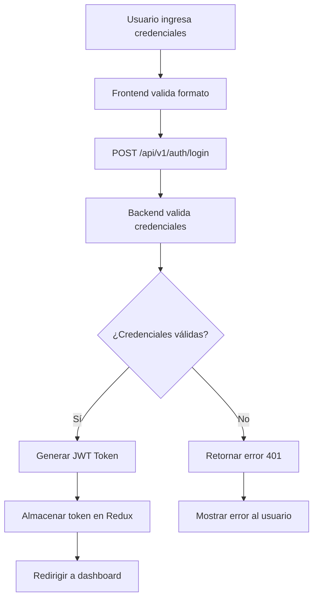
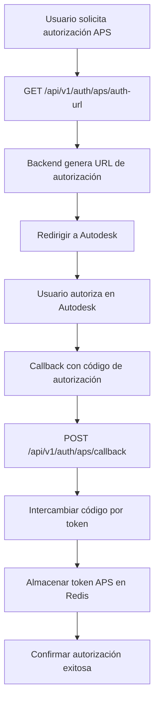
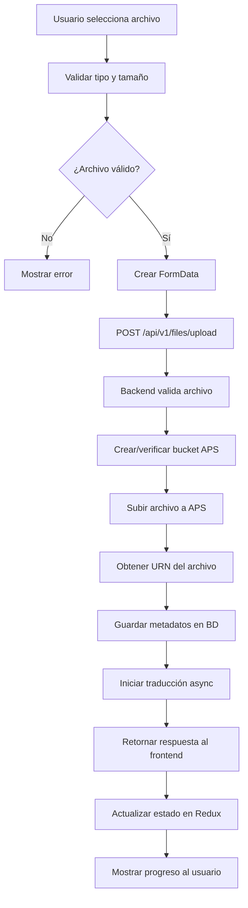
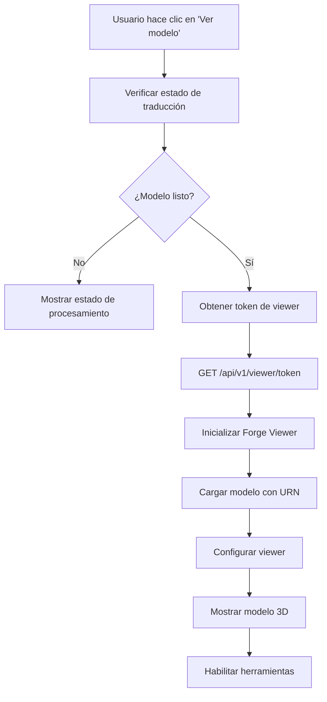

# Flujo de Datos - Sistema de Integración APS

## Introducción

Este documento detalla los flujos de datos principales en el sistema de integración con Autodesk Platform Services, incluyendo patrones de comunicación, transformación de datos y gestión de estados.

## 1. Flujos de Datos Principales

### 1.1 Flujo de Autenticación de Usuario



**Datos Involucrados:**
```typescript
// Request
interface LoginRequest {
  username: string;
  password: string;
}

// Response
interface LoginResponse {
  access_token: string;
  token_type: "bearer";
}

// Estado Redux
interface AuthState {
  user: User | null;
  token: string | null;
  isAuthenticated: boolean;
  loading: boolean;
}
```

### 1.2 Flujo de Autorización APS



**Datos del Proceso:**
```python
# Configuración APS
APS_SCOPES = ["data:read", "data:write", "data:create", "bucket:create", "bucket:read"]

# URL de autorización
auth_url = f"{APS_AUTH_URL}?client_id={CLIENT_ID}&response_type=code&redirect_uri={CALLBACK_URL}&scope={scopes}"

# Token Response
{
  "access_token": "eyJ...",
  "token_type": "Bearer",
  "expires_in": 3600
}
```

### 1.3 Flujo de Gestión de Archivos



**Estructura de Datos de Archivo:**
```typescript
interface FileUpload {
  id: string;
  name: string;
  originalFilename: string;
  size: number;
  type: string;
  urn: string;
  bucketKey: string;
  status: 'uploading' | 'uploaded' | 'translating' | 'ready' | 'error';
  progress: number;
  uploadedAt: Date;
  translatedAt?: Date;
}

interface FileState {
  files: FileUpload[];
  uploading: boolean;
  uploadProgress: Record<string, number>;
  error: string | null;
}
```

### 1.4 Flujo de Traducción de Modelos

```mermaid
graph TD
    A[Archivo subido exitosamente] --> B[Iniciar trabajo de traducción]
    B --> C[POST /modelderivative/v2/designdata/job]
    C --> D[APS procesa archivo]
    D --> E[Polling periódico de estado]
    E --> F[GET /modelderivative/v2/designdata/{urn}/manifest]
    F --> G{¿Traducción completa?}
    G -->|No| H[Esperar intervalo]
    H --> E
    G -->|Sí| I[Actualizar estado en BD]
    I --> J[Notificar al frontend]
    J --> K[Habilitar visualización]
```

**Estados de Traducción:**
```python
class TranslationStatus(Enum):
    PENDING = "pending"
    INPROGRESS = "inprogress"  
    SUCCESS = "success"
    FAILED = "failed"
    TIMEOUT = "timeout"

# Respuesta de manifest
{
  "type": "manifest",
  "hasThumbnail": "true",
  "status": "success",
  "progress": "complete",
  "region": "US",
  "urn": "dXJuOmFkc2s...",
  "derivatives": [...]
}
```

### 1.5 Flujo de Visualización en Viewer



**Configuración del Viewer:**
```typescript
interface ViewerConfig {
  urn: string;
  accessToken: string;
  api: string; // "derivativeV2"
  env: string; // "AutodeskProduction"
}

interface ViewerOptions {
  extensions: string[];
  disabledExtensions?: string[];
  theme?: 'light' | 'dark';
  backgroundColor?: string;
}

// Inicialización
const viewer = new Autodesk.Viewing.GuiViewer3D(container, {
  extensions: ['Autodesk.DocumentBrowser', 'Autodesk.Measure'],
  theme: 'light'
});
```

## 2. Patrones de Comunicación

### 2.1 Comunicación Frontend-Backend

**Patrón Request-Response:**
```typescript
// Servicio API genérico
class ApiService {
  private baseURL = process.env.REACT_APP_API_URL;
  
  async request<T>(endpoint: string, options: RequestOptions): Promise<T> {
    const url = `${this.baseURL}${endpoint}`;
    const response = await fetch(url, {
      ...options,
      headers: {
        'Content-Type': 'application/json',
        'Authorization': `Bearer ${getToken()}`,
        ...options.headers,
      },
    });
    
    if (!response.ok) {
      throw new ApiError(response.status, await response.text());
    }
    
    return response.json();
  }
}
```

**Patrón de Polling para Estados:**
```typescript
// Hook para polling de estado de traducción
function useTranslationStatus(urn: string) {
  const [status, setStatus] = useState<TranslationStatus>();
  
  useEffect(() => {
    const interval = setInterval(async () => {
      if (status !== 'success' && status !== 'failed') {
        const newStatus = await apiService.getTranslationStatus(urn);
        setStatus(newStatus);
      }
    }, 5000); // Poll cada 5 segundos
    
    return () => clearInterval(interval);
  }, [urn, status]);
  
  return status;
}
```

### 2.2 Comunicación Backend-APS

**Patrón de Cliente HTTP Asíncrono:**
```python
class APSClient:
    def __init__(self):
        self.base_url = settings.APS_BASE_URL
        self.access_token = None
    
    async def make_request(self, method: str, endpoint: str, **kwargs):
        if not self.access_token:
            await self.authenticate()
        
        headers = {
            'Authorization': f'Bearer {self.access_token}',
            'Content-Type': 'application/json'
        }
        
        async with httpx.AsyncClient() as client:
            response = await client.request(
                method=method,
                url=f"{self.base_url}{endpoint}",
                headers=headers,
                **kwargs
            )
            response.raise_for_status()
            return response.json()
```

### 2.3 Gestión de Estado Asíncrono

**Patrón Redux Async Thunk:**
```typescript
// Thunk para subida de archivo
export const uploadFile = createAsyncThunk(
  'files/upload',
  async (file: File, { rejectWithValue }) => {
    try {
      const formData = new FormData();
      formData.append('file', file);
      
      const response = await apiService.uploadFile(formData);
      return response;
    } catch (error) {
      return rejectWithValue(error.message);
    }
  }
);

// Slice de Redux
const filesSlice = createSlice({
  name: 'files',
  initialState,
  reducers: {},
  extraReducers: (builder) => {
    builder
      .addCase(uploadFile.pending, (state) => {
        state.uploading = true;
        state.error = null;
      })
      .addCase(uploadFile.fulfilled, (state, action) => {
        state.uploading = false;
        state.files.push(action.payload);
      })
      .addCase(uploadFile.rejected, (state, action) => {
        state.uploading = false;
        state.error = action.payload as string;
      });
  },
});
```

## 3. Transformación de Datos

### 3.1 Normalización de Respuestas APS

```python
def normalize_aps_bucket_response(raw_response: dict) -> BucketResponse:
    """Normalizar respuesta de bucket de APS"""
    return BucketResponse(
        bucket_key=raw_response["bucketKey"],
        bucket_owner=raw_response["bucketOwner"],
        created_date=datetime.fromisoformat(raw_response["createdDate"]),
        policy=raw_response["policyKey"],
        permissions=raw_response.get("permissions", [])
    )

def normalize_file_metadata(raw_metadata: dict) -> FileMetadata:
    """Normalizar metadatos de archivo"""
    return FileMetadata(
        guid=raw_metadata["guid"],
        type=raw_metadata["type"],
        name=raw_metadata["name"],
        progress=raw_metadata.get("progress", "0%"),
        children=[
            normalize_file_metadata(child) 
            for child in raw_metadata.get("children", [])
        ]
    )
```

### 3.2 Serialización para Frontend

```typescript
// Transformar datos de backend para UI
interface FileDisplayData {
  id: string;
  name: string;
  size: string; // Tamaño formateado
  status: FileStatus;
  statusText: string;
  uploadDate: string; // Fecha formateada
  canView: boolean;
}

function transformFileForDisplay(file: FileUpload): FileDisplayData {
  return {
    id: file.id,
    name: file.name,
    size: formatFileSize(file.size),
    status: file.status,
    statusText: getStatusText(file.status),
    uploadDate: formatDate(file.uploadedAt),
    canView: file.status === 'ready'
  };
}
```

## 4. Manejo de Errores en Flujos

### 4.1 Estrategia de Retry

```python
import asyncio
from typing import Callable, Any

async def retry_with_exponential_backoff(
    func: Callable,
    max_retries: int = 3,
    base_delay: float = 1.0,
    max_delay: float = 60.0
) -> Any:
    """Reintentar función con backoff exponencial"""
    for attempt in range(max_retries):
        try:
            return await func()
        except Exception as e:
            if attempt == max_retries - 1:
                raise e
            
            delay = min(base_delay * (2 ** attempt), max_delay)
            await asyncio.sleep(delay)
```

### 4.2 Circuit Breaker Pattern

```python
class CircuitBreaker:
    def __init__(self, failure_threshold: int = 5, timeout: int = 60):
        self.failure_threshold = failure_threshold
        self.timeout = timeout
        self.failure_count = 0
        self.last_failure_time = None
        self.state = "CLOSED"  # CLOSED, OPEN, HALF_OPEN
    
    async def call(self, func: Callable) -> Any:
        if self.state == "OPEN":
            if time.time() - self.last_failure_time > self.timeout:
                self.state = "HALF_OPEN"
            else:
                raise Exception("Circuit breaker is OPEN")
        
        try:
            result = await func()
            if self.state == "HALF_OPEN":
                self.state = "CLOSED"
                self.failure_count = 0
            return result
        except Exception as e:
            self.failure_count += 1
            self.last_failure_time = time.time()
            
            if self.failure_count >= self.failure_threshold:
                self.state = "OPEN"
            
            raise e
```

## 5. Optimizaciones de Performance

### 5.1 Cache de Respuestas

```python
from functools import wraps
import json

def cache_response(expiration: int = 300):
    """Decorator para cachear respuestas en Redis"""
    def decorator(func):
        @wraps(func)
        async def wrapper(*args, **kwargs):
            # Generar clave de cache
            cache_key = f"{func.__name__}:{hash(str(args) + str(kwargs))}"
            
            # Intentar obtener del cache
            cached_result = await redis_client.get(cache_key)
            if cached_result:
                return json.loads(cached_result)
            
            # Ejecutar función y cachear resultado
            result = await func(*args, **kwargs)
            await redis_client.setex(
                cache_key, 
                expiration, 
                json.dumps(result, default=str)
            )
            
            return result
        return wrapper
    return decorator
```

### 5.2 Paginación y Lazy Loading

```typescript
// Hook para paginación infinita
function useInfiniteFiles() {
  const [files, setFiles] = useState<FileUpload[]>([]);
  const [hasMore, setHasMore] = useState(true);
  const [loading, setLoading] = useState(false);
  
  const loadMore = useCallback(async () => {
    if (loading || !hasMore) return;
    
    setLoading(true);
    try {
      const response = await apiService.getFiles({
        offset: files.length,
        limit: 20
      });
      
      setFiles(prev => [...prev, ...response.items]);
      setHasMore(response.hasMore);
    } catch (error) {
      console.error('Error loading files:', error);
    } finally {
      setLoading(false);
    }
  }, [files.length, hasMore, loading]);
  
  return { files, loadMore, hasMore, loading };
}
```

Este flujo de datos asegura una experiencia de usuario fluida mientras mantiene la integridad y consistencia de los datos a través de todo el sistema.