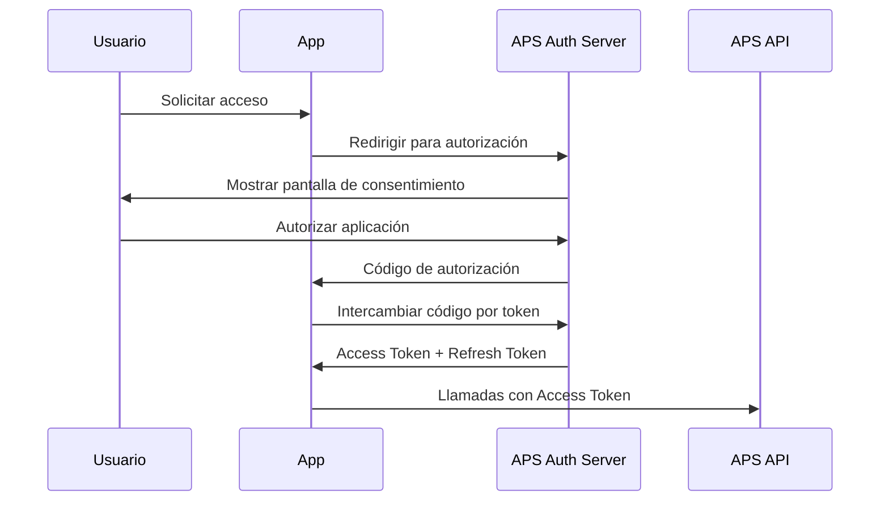

# Consideraciones de Seguridad - Sistema APS Integration

## Resumen Ejecutivo

Este documento detalla las medidas de seguridad implementadas en el sistema de integración con Autodesk Platform Services, cubriendo autenticación, autorización, protección de datos y mejores prácticas de seguridad.

## 1. Marco de Seguridad

### 1.1 Principios de Seguridad

- **Defensa en Profundidad**: Múltiples capas de seguridad
- **Principio de Menor Privilegio**: Acceso mínimo necesario
- **Seguridad por Diseño**: Integrada desde el desarrollo
- **Zero Trust**: Verificación continua de confianza
- **Transparencia**: Auditoría y logging completo

### 1.2 Modelo de Amenazas

#### Amenazas Identificadas

1. **Acceso No Autorizado**
   - Ataques de fuerza bruta
   - Credenciales comprometidas
   - Escalación de privilegios

2. **Inyección de Código**
   - SQL Injection
   - XSS (Cross-Site Scripting)
   - Command Injection

3. **Exposición de Datos**
   - Tokens de acceso expuestos
   - Archivos confidenciales
   - Información de metadatos

4. **Ataques de Red**
   - Man-in-the-Middle
   - DDoS (Distributed Denial of Service)
   - Session Hijacking

## 2. Autenticación y Autorización

### 2.1 Autenticación de Usuarios

#### JWT (JSON Web Tokens)

```python
# Configuración de JWT
ALGORITHM = "HS256"
SECRET_KEY = "super-secret-key-change-in-production"
ACCESS_TOKEN_EXPIRE_MINUTES = 60 * 24 * 8  # 8 días

# Estructura del token
{
  "sub": "user_id",
  "exp": 1234567890,
  "iat": 1234567890,
  "type": "access"
}
```

**Características de Seguridad:**
- Tokens firmados criptográficamente
- Expiración automática
- Invalidación por logout
- Rotación de claves secreta

#### Hashing de Contraseñas

```python
# Configuración bcrypt
pwd_context = CryptContext(schemes=["bcrypt"], deprecated="auto")

# Verificación
def verify_password(plain_password: str, hashed_password: str) -> bool:
    return pwd_context.verify(plain_password, hashed_password)

# Hash generation
def get_password_hash(password: str) -> str:
    return pwd_context.hash(password)
```

**Características:**
- Algoritmo bcrypt con salt automático
- Factor de trabajo adaptable
- Resistente a ataques de rainbow table

### 2.2 Integración OAuth 2.0 con APS

#### Flujo de Autorización



**Configuración de Seguridad:**
```python
# Scopes mínimos necesarios
APS_SCOPES = [
    "data:read",     # Solo lectura de datos
    "data:write",    # Escritura limitada
    "bucket:read",   # Lectura de buckets
    "bucket:create"  # Creación de buckets específicos
]

# URL de callback validada
APS_CALLBACK_URL = "https://yourdomain.com/auth/callback"
```

### 2.3 Control de Acceso Basado en Roles (RBAC)

#### Definición de Roles

```python
class UserRole(Enum):
    ADMIN = "admin"          # Acceso completo
    MANAGER = "manager"      # Gestión de proyectos
    VIEWER = "viewer"        # Solo visualización
    GUEST = "guest"          # Acceso limitado

# Permisos por rol
ROLE_PERMISSIONS = {
    UserRole.ADMIN: ["*"],
    UserRole.MANAGER: [
        "projects:create", "projects:update", "projects:delete",
        "files:upload", "files:delete", "viewer:access"
    ],
    UserRole.VIEWER: ["projects:read", "files:read", "viewer:access"],
    UserRole.GUEST: ["viewer:access"]
}
```

#### Decorador de Autorización

```python
def require_permission(permission: str):
    def decorator(func):
        @wraps(func)
        async def wrapper(*args, **kwargs):
            current_user = get_current_user()
            if not has_permission(current_user.role, permission):
                raise HTTPException(
                    status_code=403,
                    detail="Permisos insuficientes"
                )
            return await func(*args, **kwargs)
        return wrapper
    return decorator

# Uso
@require_permission("files:upload")
async def upload_file(...):
    pass
```

## 3. Protección de Datos

### 3.1 Encriptación

#### En Tránsito

- **TLS 1.3**: Todas las comunicaciones HTTPS
- **Certificate Pinning**: Validación de certificados
- **HSTS**: HTTP Strict Transport Security

```nginx
# Configuración Nginx
server {
    listen 443 ssl http2;
    
    # Certificados SSL
    ssl_certificate /path/to/cert.pem;
    ssl_certificate_key /path/to/private.key;
    
    # Configuración SSL segura
    ssl_protocols TLSv1.2 TLSv1.3;
    ssl_ciphers ECDHE-RSA-AES256-GCM-SHA512:DHE-RSA-AES256-GCM-SHA512;
    ssl_prefer_server_ciphers off;
    
    # Headers de seguridad
    add_header Strict-Transport-Security "max-age=63072000" always;
    add_header X-Content-Type-Options nosniff;
    add_header X-Frame-Options DENY;
    add_header X-XSS-Protection "1; mode=block";
}
```

#### En Reposo

- **Database Encryption**: PostgreSQL con encriptación a nivel de columna
- **File Encryption**: Archivos sensibles encriptados con AES-256

```python
from cryptography.fernet import Fernet

class DataEncryption:
    def __init__(self, key: bytes):
        self.cipher = Fernet(key)
    
    def encrypt(self, data: str) -> str:
        return self.cipher.encrypt(data.encode()).decode()
    
    def decrypt(self, encrypted_data: str) -> str:
        return self.cipher.decrypt(encrypted_data.encode()).decode()
```

### 3.2 Gestión de Secretos

#### Variables de Entorno

```bash
# Ejemplo de .env para producción
SECRET_KEY=$(openssl rand -hex 32)
POSTGRES_PASSWORD=$(openssl rand -base64 32)
APS_CLIENT_SECRET=secure_secret_from_autodesk
REDIS_PASSWORD=$(openssl rand -base64 16)
```

#### Vault de Secretos (Recomendado para Producción)

```python
# Integración con HashiCorp Vault
import hvac

class SecretManager:
    def __init__(self, vault_url: str, token: str):
        self.client = hvac.Client(url=vault_url, token=token)
    
    def get_secret(self, path: str) -> dict:
        response = self.client.secrets.kv.v2.read_secret_version(path=path)
        return response['data']['data']
```

## 4. Validación de Entrada

### 4.1 Validación con Pydantic

```python
from pydantic import BaseModel, validator, EmailStr
from typing import Optional

class UserCreate(BaseModel):
    email: EmailStr
    password: str
    full_name: Optional[str] = None
    
    @validator('password')
    def validate_password(cls, v):
        if len(v) < 8:
            raise ValueError('Password debe tener al menos 8 caracteres')
        if not any(c.isupper() for c in v):
            raise ValueError('Password debe contener al menos una mayúscula')
        if not any(c.islower() for c in v):
            raise ValueError('Password debe contener al menos una minúscula')
        if not any(c.isdigit() for c in v):
            raise ValueError('Password debe contener al menos un número')
        return v
```

### 4.2 Sanitización de Archivos

```python
import magic
from pathlib import Path

ALLOWED_MIME_TYPES = [
    'application/octet-stream',  # RVT, DWG
    'model/ifc',                 # IFC
    'application/x-3ds',         # 3DS
]

def validate_file_upload(file: UploadFile) -> bool:
    # Verificar extensión
    file_extension = Path(file.filename).suffix.lower()
    if file_extension not in ALLOWED_EXTENSIONS:
        return False
    
    # Verificar MIME type real
    file_content = file.file.read(1024)
    file.file.seek(0)  # Reset file pointer
    
    mime_type = magic.from_buffer(file_content, mime=True)
    if mime_type not in ALLOWED_MIME_TYPES:
        return False
    
    return True
```

## 5. Protección contra Ataques

### 5.1 Rate Limiting

```python
from slowapi import Limiter, _rate_limit_exceeded_handler
from slowapi.util import get_remote_address
from slowapi.errors import RateLimitExceeded

limiter = Limiter(key_func=get_remote_address)

# Por usuario autenticado
@limiter.limit("100/minute")
async def api_endpoint(request: Request):
    pass

# Por IP para endpoints públicos
@limiter.limit("10/minute")
async def public_endpoint(request: Request):
    pass
```

### 5.2 Protección CSRF

```python
from fastapi_csrf_protect import CsrfProtect

@app.post("/api/v1/files/upload")
async def upload_file(
    request: Request,
    csrf_protect: CsrfProtect = Depends()
):
    csrf_protect.validate_csrf(request)
    # ... resto de la lógica
```

### 5.3 Validación de CORS

```python
from fastapi.middleware.cors import CORSMiddleware

app.add_middleware(
    CORSMiddleware,
    allow_origins=["https://yourdomain.com"],  # Solo dominios específicos
    allow_credentials=True,
    allow_methods=["GET", "POST", "PUT", "DELETE"],
    allow_headers=["*"],
)
```

## 6. Auditoría y Logging

### 6.1 Logging de Seguridad

```python
import structlog

security_logger = structlog.get_logger("security")

def log_security_event(event_type: str, user_id: str, details: dict):
    security_logger.info(
        "Security event",
        event_type=event_type,
        user_id=user_id,
        timestamp=datetime.utcnow().isoformat(),
        ip_address=get_client_ip(),
        user_agent=get_user_agent(),
        **details
    )

# Ejemplos de uso
log_security_event("login_attempt", user_id, {"success": True})
log_security_event("file_upload", user_id, {"filename": "model.rvt"})
log_security_event("permission_denied", user_id, {"resource": "/admin"})
```

### 6.2 Monitoreo de Anomalías

```python
# Detección de patrones sospechosos
class SecurityMonitor:
    def check_login_attempts(self, user_id: str, ip: str):
        recent_attempts = get_failed_attempts(user_id, last_minutes=15)
        if recent_attempts > 5:
            self.trigger_account_lockout(user_id)
            self.send_security_alert(user_id, "multiple_failed_logins")
    
    def check_file_access_patterns(self, user_id: str):
        files_accessed = get_files_accessed(user_id, last_hour=1)
        if len(files_accessed) > 50:  # Threshold sospechoso
            self.send_security_alert(user_id, "unusual_file_access")
```

## 7. Configuración de Seguridad por Entorno

### 7.1 Desarrollo

```python
# settings/development.py
DEBUG = True
ALLOWED_HOSTS = ["localhost", "127.0.0.1"]
SECRET_KEY = "dev-secret-key"  # Solo para desarrollo
CORS_ALLOW_ALL_ORIGINS = True  # Solo para desarrollo
```

### 7.2 Producción

```python
# settings/production.py
DEBUG = False
ALLOWED_HOSTS = ["yourdomain.com", "api.yourdomain.com"]
SECRET_KEY = os.environ["SECRET_KEY"]  # Desde variable de entorno
CORS_ALLOW_ALL_ORIGINS = False
SECURE_SSL_REDIRECT = True
SESSION_COOKIE_SECURE = True
CSRF_COOKIE_SECURE = True
```

## 8. Plan de Respuesta a Incidentes

### 8.1 Clasificación de Incidentes

- **Crítico**: Compromiso de datos, acceso no autorizado masivo
- **Alto**: Vulnerabilidad explotada, falla de autenticación
- **Medio**: Intento de ataque detectado, configuración incorrecta
- **Bajo**: Actividad sospechosa menor

### 8.2 Procedimientos de Respuesta

1. **Detección y Análisis**
   - Monitoreo automatizado
   - Análisis de logs
   - Verificación manual

2. **Contención**
   - Bloqueo de IPs maliciosas
   - Revocación de tokens comprometidos
   - Aislamiento de sistemas afectados

3. **Erradicación**
   - Eliminación de malware
   - Cierre de vulnerabilidades
   - Actualización de sistemas

4. **Recuperación**
   - Restauración de servicios
   - Validación de integridad
   - Monitoreo continuo

5. **Lecciones Aprendidas**
   - Documentación del incidente
   - Mejoras en procesos
   - Actualización de políticas

## 9. Checklist de Seguridad

### 9.1 Pre-Despliegue

- [ ] Secrets configurados correctamente
- [ ] Certificados SSL válidos instalados
- [ ] Rate limiting configurado
- [ ] Logging de seguridad habilitado
- [ ] Validaciones de entrada implementadas
- [ ] CORS configurado restrictivamente
- [ ] Headers de seguridad configurados

### 9.2 Post-Despliegue

- [ ] Monitoreo de logs activo
- [ ] Alertas de seguridad configuradas
- [ ] Backups encriptados configurados
- [ ] Actualizaciones de seguridad aplicadas
- [ ] Penetration testing realizado
- [ ] Documentación de seguridad actualizada

## 10. Recursos y Referencias

### 10.1 Estándares de Seguridad

- **OWASP Top 10**: Vulnerabilidades web más críticas
- **NIST Cybersecurity Framework**: Marco de ciberseguridad
- **ISO 27001**: Estándar de gestión de seguridad de la información

### 10.2 Herramientas Recomendadas

- **SAST**: SonarQube, Bandit (Python)
- **DAST**: OWASP ZAP, Burp Suite
- **Monitoring**: Elastic Stack, Splunk
- **Secrets Management**: HashiCorp Vault, AWS Secrets Manager

La seguridad es un proceso continuo que requiere revisión y actualización constante. Este documento debe ser revisado y actualizado regularmente conforme evolucionan las amenazas y se implementan nuevas funcionalidades.