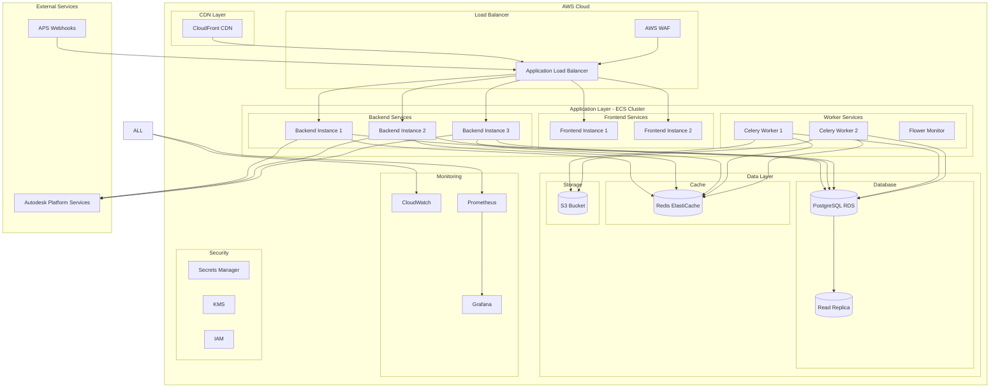
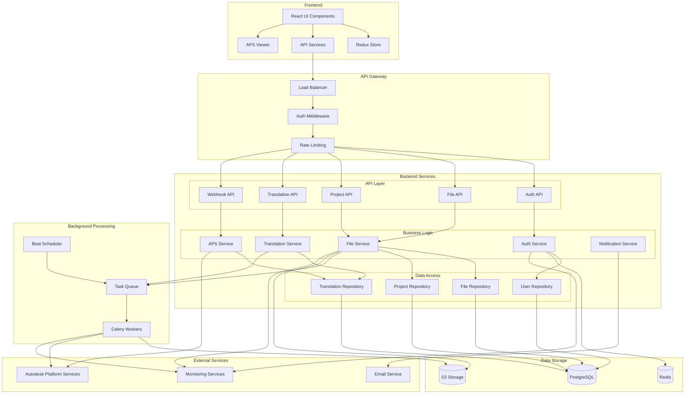
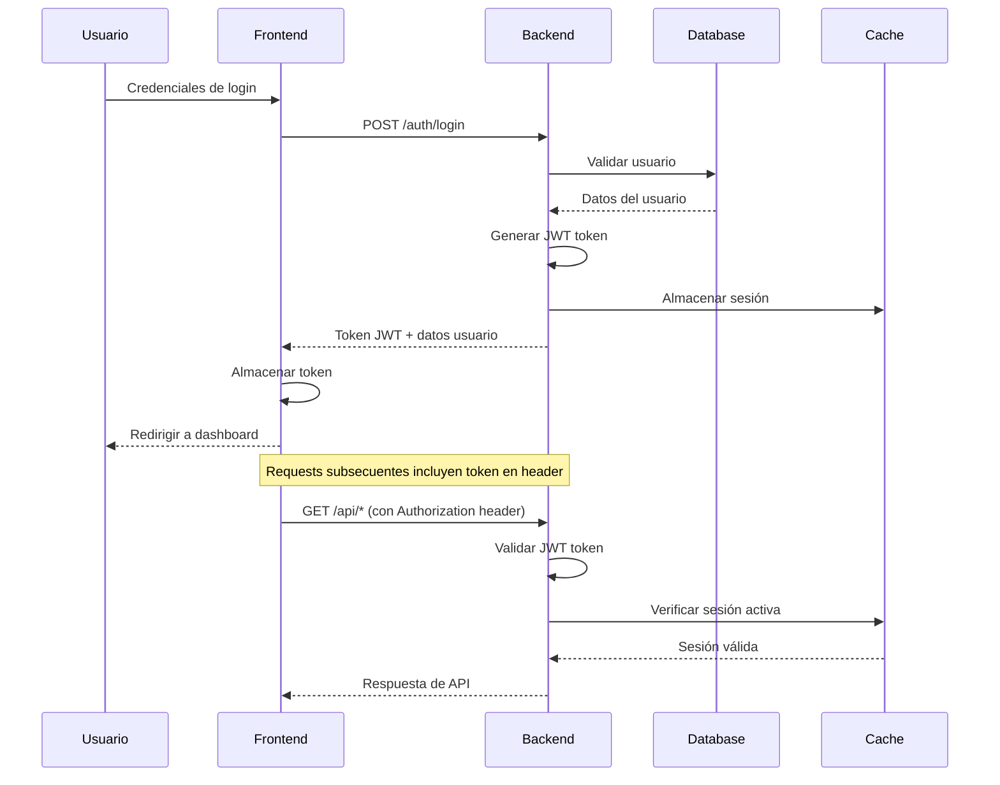
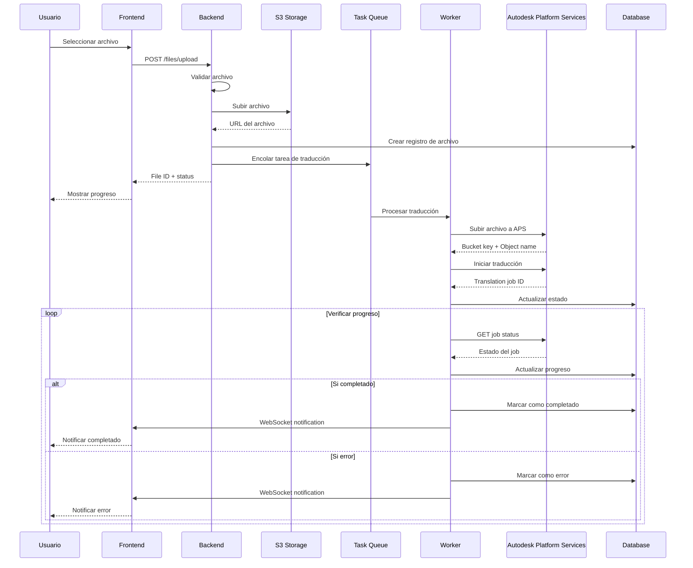
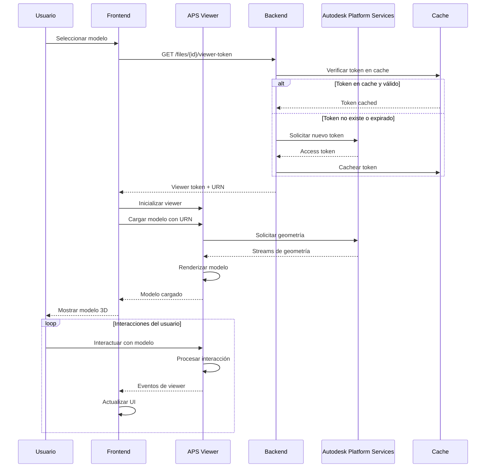

# Arquitectura del Sistema APS - Documentación Completa

## Resumen Ejecutivo

Este documento describe la arquitectura completa del sistema de integración con Autodesk Platform Services (APS), diseñado para proporcionar una plataforma escalable, segura y eficiente para la gestión, traducción y visualización de modelos CAD/BIM.

## Tabla de Contenidos

1. [Visión General de la Arquitectura](#visión-general-de-la-arquitectura)
2. [Componentes del Sistema](#componentes-del-sistema)
3. [Stack Tecnológico](#stack-tecnológico)
4. [Diagramas de Arquitectura](#diagramas-de-arquitectura)
5. [Flujo de Datos](#flujo-de-datos)
6. [Patrones de Diseño](#patrones-de-diseño)
7. [Escalabilidad y Performance](#escalabilidad-y-performance)
8. [Seguridad](#seguridad)
9. [Monitoreo y Observabilidad](#monitoreo-y-observabilidad)

## Visión General de la Arquitectura

### Principios de Diseño

1. **Microservicios**: Arquitectura basada en servicios independientes y desacoplados
2. **Escalabilidad Horizontal**: Capacidad de escalar componentes individualmente
3. **Resilencia**: Tolerancia a fallos y recuperación automática
4. **Seguridad por Diseño**: Implementación de seguridad en todas las capas
5. **Observabilidad**: Monitoreo, logging y métricas comprensivas
6. **DevOps**: Integración y despliegue continuo automatizado

### Arquitectura de Alto Nivel

```
┌─────────────────────────────────────────────────────────────────────┐
│                            USUARIOS FINALES                         │
└─────────────────────────┬───────────────────────────────────────────┘
                          │
┌─────────────────────────▼───────────────────────────────────────────┐
│                         CDN / CloudFront                            │
└─────────────────────────┬───────────────────────────────────────────┘
                          │
┌─────────────────────────▼───────────────────────────────────────────┐
│                    Application Load Balancer                        │
└─────────────────────────┬───────────────────────────────────────────┘
                          │
        ┌─────────────────┼─────────────────┐
        │                 │                 │
┌───────▼──────┐ ┌────────▼──────┐ ┌────────▼──────┐
│   Frontend   │ │   Backend     │ │   WebSocket   │
│  (React App) │ │  (FastAPI)    │ │   Gateway     │
└──────────────┘ └───────┬───────┘ └───────────────┘
                         │
        ┌────────────────┼────────────────┐
        │                │                │
┌───────▼──────┐ ┌───────▼───────┐ ┌──────▼──────┐
│   Database   │ │     Cache     │ │  Task Queue │
│ (PostgreSQL) │ │   (Redis)     │ │  (Celery)   │
└──────────────┘ └───────────────┘ └─────────────┘
                         │
┌────────────────────────▼────────────────────────┐
│                External Services                │
│  • Autodesk Platform Services (APS)            │
│  • AWS S3 (File Storage)                       │
│  • AWS SES (Email)                             │
│  • Monitoring & Logging                        │
└─────────────────────────────────────────────────┘
```

## Componentes del Sistema

### 1. Frontend Layer

#### React Application
- **Framework**: React 18 con TypeScript
- **State Management**: Redux Toolkit
- **UI Framework**: Tailwind CSS
- **Build Tool**: Vite
- **Testing**: Vitest + Cypress

**Características principales:**
- Single Page Application (SPA)
- Progressive Web App (PWA) capabilities
- Responsive design
- Real-time updates via WebSocket
- Autodesk Viewer integration

#### Componentes Clave
```
src/
├── components/
│   ├── viewer/          # APS Viewer components
│   ├── files/           # File management
│   ├── translation/     # Translation status
│   ├── auth/            # Authentication
│   └── ui/              # Shared UI components
├── pages/               # Page components
├── hooks/               # Custom React hooks
├── services/            # API services
├── store/               # Redux store
└── types/               # TypeScript definitions
```

### 2. Backend Layer

#### FastAPI Application
- **Framework**: FastAPI (Python)
- **Authentication**: JWT + OAuth2
- **Database ORM**: SQLAlchemy
- **Migration**: Alembic
- **Validation**: Pydantic

**Arquitectura de capas:**
```
app/
├── api/                 # API endpoints
├── core/                # Core configuration
├── models/              # Database models
├── schemas/             # Pydantic schemas
├── services/            # Business logic
├── tasks/               # Background tasks
└── utils/               # Utilities
```

#### Servicios Principales

1. **Authentication Service**
   - JWT token management
   - User session handling
   - Role-based access control (RBAC)

2. **File Management Service**
   - File upload/download
   - Metadata extraction
   - Storage management (S3)

3. **APS Integration Service**
   - Authentication with APS
   - Model translation
   - Viewer token generation
   - Webhook handling

4. **Translation Manager**
   - Asynchronous translation jobs
   - Progress tracking
   - Error handling and retry logic

### 3. Data Layer

#### PostgreSQL Database
- **Version**: PostgreSQL 15
- **Features**: 
  - ACID compliance
  - JSON support
  - Full-text search
  - Partitioning
  - Replication

**Schema principal:**
```sql
-- Usuarios y autenticación
users
user_sessions
roles
permissions

-- Proyectos y archivos
projects
files
file_metadata
viewer_sessions

-- Traducción y procesamiento
translation_jobs
job_status
error_logs

-- Auditoría
audit_logs
api_usage
```

#### Redis Cache
- **Version**: Redis 7.x
- **Uso**:
  - Session storage
  - API response caching
  - Task queue (Celery)
  - Real-time data

### 4. Processing Layer

#### Celery Workers
- **Broker**: Redis
- **Workers**: Distributed processing
- **Monitoring**: Flower

**Tareas principales:**
1. File processing and validation
2. APS translation jobs
3. Metadata extraction
4. Email notifications
5. Data cleanup and maintenance

### 5. External Integrations

#### Autodesk Platform Services (APS)
- **Authentication**: 3-legged OAuth
- **Services Used**:
  - Model Derivative API
  - Data Management API
  - Webhook API

#### AWS Services
- **S3**: File storage
- **SES**: Email notifications
- **CloudWatch**: Monitoring
- **Secrets Manager**: Credential management

## Stack Tecnológico

### Frontend Stack
```yaml
Core:
  - React 18
  - TypeScript 5
  - Vite 4
  - Tailwind CSS 3

State Management:
  - Redux Toolkit
  - RTK Query

UI/UX:
  - Headless UI
  - Heroicons
  - Framer Motion

Testing:
  - Vitest
  - Cypress
  - Testing Library

Build & Deploy:
  - Docker
  - Nginx
  - AWS CloudFront
```

### Backend Stack
```yaml
Core:
  - Python 3.11
  - FastAPI 0.104
  - SQLAlchemy 2.0
  - Alembic
  - Pydantic 2.0

Database:
  - PostgreSQL 15
  - Redis 7.x

Processing:
  - Celery 5.3
  - Flower

Security:
  - JWT tokens
  - bcrypt
  - python-jose

Testing:
  - pytest
  - pytest-asyncio
  - httpx

Monitoring:
  - structlog
  - prometheus-client
```

### Infrastructure Stack
```yaml
Containerization:
  - Docker
  - Docker Compose

Orchestration:
  - AWS ECS Fargate
  - AWS Application Load Balancer

Infrastructure as Code:
  - Terraform
  - AWS CloudFormation

CI/CD:
  - GitHub Actions
  - AWS CodePipeline

Monitoring:
  - Prometheus
  - Grafana
  - AWS CloudWatch
  - ELK Stack

Security:
  - AWS WAF
  - AWS Secrets Manager
  - AWS KMS
```

## Diagramas de Arquitectura

### Diagrama de Despliegue



### Diagrama de Componentes



## Flujo de Datos

### Flujo de Autenticación



### Flujo de Subida y Traducción de Archivos



### Flujo de Visualización



## Patrones de Diseño

### 1. Repository Pattern
```python
# Abstracción de acceso a datos
class FileRepository:
    async def create(self, file_data: FileCreate) -> File:
        pass
    
    async def get_by_id(self, file_id: int) -> Optional[File]:
        pass
    
    async def get_by_user(self, user_id: int) -> List[File]:
        pass
```

### 2. Service Layer Pattern
```python
# Lógica de negocio encapsulada
class FileService:
    def __init__(self, file_repo: FileRepository, aps_service: APSService):
        self.file_repo = file_repo
        self.aps_service = aps_service
    
    async def upload_and_translate(self, file_data: UploadFile) -> TranslationJob:
        # Lógica compleja de negocio
        pass
```

### 3. Observer Pattern
```python
# Sistema de eventos para notificaciones
class TranslationEventManager:
    def subscribe(self, event_type: str, handler: Callable):
        pass
    
    def publish(self, event: TranslationEvent):
        pass
```

### 4. Factory Pattern
```python
# Creación de servicios APS según configuración
class APSServiceFactory:
    @staticmethod
    def create_service(environment: str) -> APSService:
        if environment == "production":
            return ProductionAPSService()
        else:
            return SandboxAPSService()
```

## Escalabilidad y Performance

### Estrategias de Escalabilidad

#### Horizontal Scaling
- **Frontend**: Multiple instances behind load balancer
- **Backend**: Auto-scaling ECS services
- **Database**: Read replicas for read-heavy operations
- **Cache**: Redis cluster for distributed caching

#### Vertical Scaling
- **Database**: Instance size upgrades
- **Cache**: Memory optimization
- **Compute**: CPU/Memory adjustments

### Optimizaciones de Performance

#### Database Optimizations
```sql
-- Índices optimizados
CREATE INDEX CONCURRENTLY idx_files_user_status 
ON files(user_id, status) WHERE deleted_at IS NULL;

-- Particionado por fecha
CREATE TABLE translation_jobs_2024 PARTITION OF translation_jobs
FOR VALUES FROM ('2024-01-01') TO ('2025-01-01');

-- Materialised views para reportes
CREATE MATERIALIZED VIEW user_file_stats AS
SELECT user_id, COUNT(*) as file_count, SUM(file_size) as total_size
FROM files WHERE deleted_at IS NULL
GROUP BY user_id;
```

#### Caching Strategy
```python
# Cache layers
CACHE_LAYERS = {
    "user_sessions": 3600,      # 1 hour
    "file_metadata": 1800,      # 30 minutes
    "viewer_tokens": 3300,      # 55 minutes (APS tokens expire in 1h)
    "translation_status": 300,   # 5 minutes
}
```

#### CDN Configuration
```yaml
CloudFront:
  behaviors:
    "*.js|*.css|*.png|*.jpg":
      cache_policy: "CachingOptimized"
      ttl: 31536000  # 1 year
    "/api/*":
      cache_policy: "CachingDisabled"
    "/":
      cache_policy: "CachingOptimized"
      ttl: 86400     # 1 day
```

### Performance Metrics

#### Target SLAs
```yaml
Response Times:
  API_endpoints: "< 200ms (p95)"
  File_upload: "< 5s (for files < 100MB)"
  Model_loading: "< 10s (first load)"
  Page_load: "< 3s (initial)"

Availability:
  Service_uptime: "99.9%"
  Database_uptime: "99.95%"

Throughput:
  Concurrent_users: "1000+"
  File_uploads: "100/hour per user"
  API_requests: "10000/minute"
```

## Seguridad

### Autenticación y Autorización

#### JWT Token Security
```python
JWT_CONFIG = {
    "algorithm": "RS256",
    "access_token_expire_minutes": 60,
    "refresh_token_expire_days": 30,
    "issuer": "aps-integration",
    "audience": "aps-api",
}
```

#### Role-Based Access Control (RBAC)
```yaml
Roles:
  admin:
    permissions: ["*"]
  
  project_manager:
    permissions:
      - "project:create"
      - "project:read"
      - "project:update"
      - "file:*"
  
  viewer:
    permissions:
      - "project:read"
      - "file:read"
      - "file:view"

  guest:
    permissions:
      - "file:view"
```

### Seguridad de Datos

#### Encryption
```yaml
At_Rest:
  database: "AES-256 (AWS KMS)"
  files: "AES-256 (S3 Server-Side)"
  cache: "AES-256 (ElastiCache)"

In_Transit:
  https: "TLS 1.3"
  database: "SSL/TLS"
  cache: "SSL/TLS"
  internal: "mTLS (service mesh)"
```

#### Data Privacy
```python
# PII Data handling
class PersonalDataManager:
    @staticmethod
    def anonymize_user_data(user_id: int):
        # GDPR compliance for data anonymization
        pass
    
    @staticmethod
    def export_user_data(user_id: int) -> UserDataExport:
        # GDPR right to data portability
        pass
```

### Security Headers
```nginx
# Nginx security headers
add_header X-Frame-Options "SAMEORIGIN" always;
add_header X-Content-Type-Options "nosniff" always;
add_header X-XSS-Protection "1; mode=block" always;
add_header Referrer-Policy "strict-origin-when-cross-origin" always;
add_header Content-Security-Policy "default-src 'self'; script-src 'self' 'unsafe-inline' https://developer.api.autodesk.com; style-src 'self' 'unsafe-inline'; img-src 'self' data: https:; connect-src 'self' https://developer.api.autodesk.com wss://;" always;
add_header Strict-Transport-Security "max-age=31536000; includeSubDomains" always;
```

### Input Validation
```python
# Pydantic models for validation
class FileUpload(BaseModel):
    filename: str = Field(..., max_length=255, regex=r'^[a-zA-Z0-9._-]+$')
    content_type: str = Field(..., regex=r'^[a-zA-Z0-9]+/[a-zA-Z0-9.-]+$')
    size: int = Field(..., gt=0, le=500_000_000)  # Max 500MB
    
    @validator('filename')
    def validate_filename(cls, v):
        if v.lower().endswith(('.exe', '.bat', '.sh')):
            raise ValueError('Executable files not allowed')
        return v
```

## Monitoreo y Observabilidad

### Logging Strategy

#### Structured Logging
```python
import structlog

logger = structlog.configure(
    processors=[
        structlog.stdlib.filter_by_level,
        structlog.stdlib.add_logger_name,
        structlog.stdlib.add_log_level,
        structlog.stdlib.PositionalArgumentsFormatter(),
        structlog.processors.TimeStamper(fmt="iso"),
        structlog.processors.StackInfoRenderer(),
        structlog.processors.format_exc_info,
        structlog.processors.UnicodeDecoder(),
        structlog.processors.JSONRenderer()
    ],
    context_class=dict,
    logger_factory=structlog.stdlib.LoggerFactory(),
    cache_logger_on_first_use=True,
)

# Usage
logger.info("file_uploaded", 
           user_id=user.id, 
           file_id=file.id, 
           file_size=file.size,
           duration=upload_time)
```

#### Log Levels and Categories
```yaml
Log_Levels:
  ERROR: "System errors, exceptions"
  WARN: "Performance issues, deprecated usage"
  INFO: "Business events, user actions"
  DEBUG: "Detailed technical information"

Categories:
  security: "Authentication, authorization events"
  performance: "Response times, resource usage"
  business: "User actions, transactions"
  system: "Health checks, configuration changes"
  audit: "Data access, modifications"
```

### Metrics and Monitoring

#### Application Metrics
```python
from prometheus_client import Counter, Histogram, Gauge

# Business metrics
file_uploads_total = Counter('file_uploads_total', 'Total file uploads', ['user_id', 'file_type'])
translation_duration = Histogram('translation_duration_seconds', 'Translation job duration')
active_users = Gauge('active_users_total', 'Currently active users')

# Technical metrics
api_requests_total = Counter('api_requests_total', 'Total API requests', ['method', 'endpoint', 'status'])
database_connections = Gauge('database_connections_active', 'Active database connections')
cache_hit_rate = Gauge('cache_hit_rate', 'Cache hit rate percentage')
```

#### Infrastructure Metrics
```yaml
System_Metrics:
  cpu_usage: "CPU utilization percentage"
  memory_usage: "Memory utilization percentage"
  disk_usage: "Disk space utilization"
  network_io: "Network input/output rates"

Application_Metrics:
  request_rate: "Requests per second"
  response_time: "Response time percentiles"
  error_rate: "Error rate percentage"
  throughput: "Transactions per second"

Business_Metrics:
  user_registrations: "New user sign-ups"
  file_uploads: "Files uploaded per period"
  translations_completed: "Successful translations"
  active_sessions: "Concurrent user sessions"
```

### Alerting Rules

#### Critical Alerts
```yaml
alerts:
  - name: HighErrorRate
    expr: rate(api_requests_total{status=~"5.."}[5m]) > 0.1
    for: 2m
    severity: critical
    summary: "High error rate detected"
    
  - name: DatabaseConnectionExhaustion
    expr: database_connections_active / database_connections_max > 0.9
    for: 1m
    severity: critical
    summary: "Database connection pool nearly exhausted"
    
  - name: HighMemoryUsage
    expr: memory_usage_percent > 90
    for: 5m
    severity: warning
    summary: "High memory usage detected"
```

### Health Checks

#### Application Health Endpoint
```python
@router.get("/health")
async def health_check():
    checks = {
        "database": await check_database_connection(),
        "cache": await check_redis_connection(),
        "aps": await check_aps_connectivity(),
        "storage": await check_s3_connectivity(),
    }
    
    overall_status = "healthy" if all(checks.values()) else "unhealthy"
    
    return {
        "status": overall_status,
        "timestamp": datetime.utcnow().isoformat(),
        "checks": checks,
        "version": get_app_version(),
    }
```

### Distributed Tracing

#### OpenTelemetry Integration
```python
from opentelemetry import trace
from opentelemetry.exporter.jaeger.thrift import JaegerExporter
from opentelemetry.sdk.trace import TracerProvider
from opentelemetry.sdk.trace.export import BatchSpanProcessor

# Configure tracing
trace.set_tracer_provider(TracerProvider())
tracer = trace.get_tracer(__name__)

jaeger_exporter = JaegerExporter(
    agent_host_name="localhost",
    agent_port=6831,
)

span_processor = BatchSpanProcessor(jaeger_exporter)
trace.get_tracer_provider().add_span_processor(span_processor)

# Usage in code
@tracer.start_as_current_span("file_upload")
async def upload_file(file: UploadFile):
    with tracer.start_as_current_span("validate_file"):
        await validate_file(file)
    
    with tracer.start_as_current_span("store_file"):
        await store_file_to_s3(file)
```

## Consideraciones de Deployment

### Ambientes

#### Development
```yaml
Environment: development
Instances:
  frontend: 1
  backend: 1
  workers: 1
  
Database:
  instance_class: db.t3.micro
  multi_az: false
  
Cache:
  node_type: cache.t4g.micro
  num_nodes: 1
```

#### Staging
```yaml
Environment: staging
Instances:
  frontend: 2
  backend: 2
  workers: 2
  
Database:
  instance_class: db.t3.small
  multi_az: true
  read_replica: true
  
Cache:
  node_type: cache.t4g.small
  num_nodes: 2
```

#### Production
```yaml
Environment: production
Instances:
  frontend: 3
  backend: 5
  workers: 3
  
Database:
  instance_class: db.r6g.large
  multi_az: true
  read_replicas: 2
  
Cache:
  node_type: cache.r6g.large
  num_nodes: 3
  
Features:
  auto_scaling: enabled
  backup_retention: 30_days
  monitoring: enhanced
```

### Blue/Green Deployment

```yaml
Deployment_Strategy:
  type: blue_green
  
  blue_environment:
    status: active
    traffic_percentage: 100
    
  green_environment:
    status: standby
    traffic_percentage: 0
    
  rollout_process:
    1: "Deploy to green environment"
    2: "Run health checks"
    3: "Run smoke tests"
    4: "Gradually shift traffic (10%, 50%, 100%)"
    5: "Monitor metrics and errors"
    6: "Complete switch or rollback"
```

### Disaster Recovery

#### Backup Strategy
```yaml
Database_Backups:
  automated_backups: daily
  retention: 30_days
  point_in_time_recovery: enabled
  cross_region_backup: enabled
  
File_Storage_Backups:
  versioning: enabled
  cross_region_replication: enabled
  lifecycle_policies: enabled
  
Configuration_Backups:
  terraform_state: s3_backend_with_versioning
  secrets: automated_backup_to_secondary_region
  application_config: version_controlled
```

#### Recovery Procedures
```yaml
RTO_Targets:
  database_failure: "< 15 minutes"
  application_failure: "< 5 minutes"
  complete_region_failure: "< 2 hours"
  
RPO_Targets:
  database: "< 5 minutes"
  file_storage: "< 1 hour"
  configuration: "< 1 minute"
```

---

*Este documento representa la arquitectura completa del sistema APS y debe ser actualizado conforme evolucione el sistema.*
