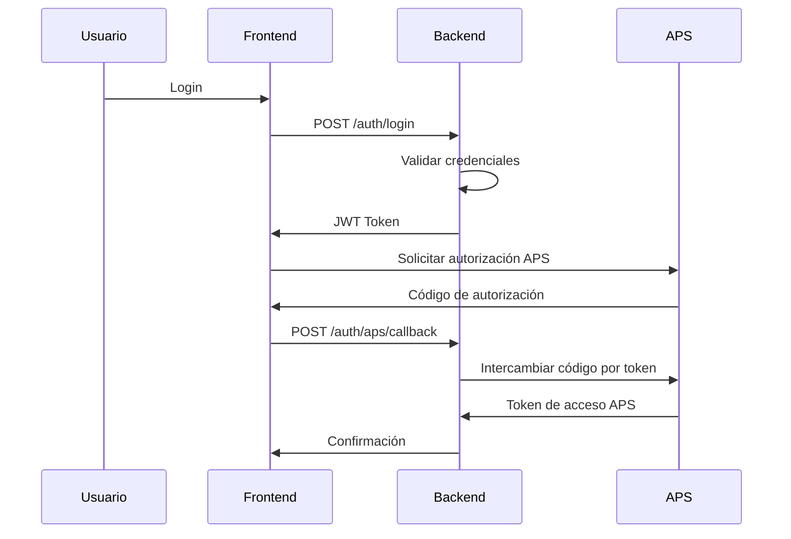
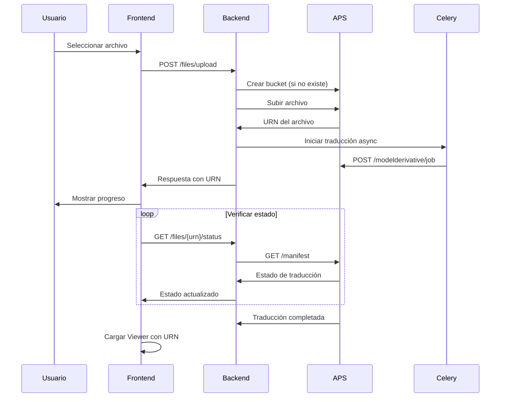

# Arquitectura del Sistema - Integración APS

## Resumen Ejecutivo

Este documento describe la arquitectura completa del sistema de integración con Autodesk Platform Services (APS), diseñado para proporcionar una plataforma robusta, escalable y segura para la visualización y gestión de modelos CAD/BIM.

## 1. Visión General de la Arquitectura

### 1.1 Principios Arquitectónicos

- **Modularidad**: Separación clara entre frontend, backend y servicios externos
- **Escalabilidad**: Diseño que permite crecimiento horizontal y vertical
- **Seguridad**: Implementación de mejores prácticas de seguridad en todas las capas
- **Mantenibilidad**: Código limpio, documentado y fácil de mantener
- **Performance**: Optimización para respuesta rápida y manejo eficiente de recursos

### 1.2 Patrón Arquitectónico

El sistema sigue un patrón de **arquitectura de microservicios** con separación clara de responsabilidades:

```
┌─────────────────────────────────────────────────────────────┐
│                        FRONTEND                             │
│              React + Redux + APS Viewer                     │
└─────────────────────────────────────────────────────────────┘
                                │
                       ┌────────┴────────┐
                       │   API Gateway   │
                       │     (Nginx)     │
                       └────────┬────────┘
                                │
┌─────────────────────────────────────────────────────────────┐
│                       BACKEND                               │
│                   FastAPI + Python                         │
├─────────────────────┬─────────────────┬─────────────────────┤
│   Authentication    │   APS Service   │   File Service      │
│     Service         │                 │                     │
└─────────────────────┴─────────────────┴─────────────────────┘
                                │
                ┌───────────────┼───────────────┐
                │               │               │
      ┌─────────┴────┐ ┌────────┴────┐ ┌───────┴────────┐
      │  PostgreSQL  │ │    Redis    │ │ Autodesk APS   │
      │   Database   │ │    Cache    │ │   Platform     │
      └──────────────┘ └─────────────┘ └────────────────┘
```

## 2. Componentes del Sistema

### 2.1 Frontend (React Application)

**Tecnologías:**
- React 18 con TypeScript
- Redux Toolkit para gestión de estado
- React Router para navegación
- Tailwind CSS para estilos
- Autodesk Forge Viewer v7

**Responsabilidades:**
- Interfaz de usuario intuitiva y responsiva
- Integración con APS Viewer para visualización 3D
- Gestión de estado de aplicación
- Comunicación con API backend
- Autenticación de usuarios

**Estructura de Directorios:**
```
frontend/
├── src/
│   ├── components/     # Componentes reutilizables
│   ├── pages/         # Páginas de la aplicación
│   ├── hooks/         # Custom hooks
│   ├── services/      # Servicios de API
│   ├── store/         # Redux store y slices
│   ├── types/         # Definiciones de tipos TypeScript
│   └── utils/         # Utilidades y helpers
```

### 2.2 Backend (FastAPI Application)

**Tecnologías:**
- FastAPI con Python 3.11+
- SQLAlchemy para ORM
- Alembic para migraciones
- Celery para tareas asíncronas
- Pydantic para validación de datos

**Responsabilidades:**
- API RESTful para frontend
- Integración con APS/Forge APIs
- Gestión de autenticación y autorización
- Procesamiento de archivos CAD/BIM
- Orquestación de tareas asíncronas

**Estructura de Directorios:**
```
backend/
├── app/
│   ├── api/           # Endpoints de la API
│   ├── core/          # Configuración y seguridad
│   ├── models/        # Modelos de base de datos
│   ├── schemas/       # Esquemas Pydantic
│   ├── services/      # Lógica de negocio
│   └── utils/         # Utilidades
```

### 2.3 Base de Datos (PostgreSQL)

**Responsabilidades:**
- Almacenamiento de datos de usuarios
- Metadatos de proyectos y archivos
- Logs de actividad y auditoría
- Configuraciones del sistema

**Esquema Principal:**
```sql
-- Usuarios
users (id, email, hashed_password, is_active, created_at)

-- Proyectos
projects (id, name, description, user_id, aps_bucket_key, created_at)

-- Archivos
files (id, name, original_filename, urn, project_id, status, uploaded_at)

-- Sesiones de visualización
viewer_sessions (id, user_id, file_id, started_at, ended_at)
```

### 2.4 Cache (Redis)

**Responsabilidades:**
- Cache de tokens de APS
- Sesiones de usuario
- Cache de respuestas de API
- Cola de tareas para Celery

### 2.5 Servicios Externos

#### Autodesk Platform Services (APS)
- **Data Management API**: Gestión de buckets y archivos
- **Model Derivative API**: Conversión y procesamiento de modelos
- **Viewer**: Visualización 3D en el navegador

## 3. Flujo de Datos

### 3.1 Flujo de Autenticación



### 3.2 Flujo de Subida y Visualización de Archivos



## 4. Seguridad

### 4.1 Autenticación y Autorización

- **JWT Tokens** para autenticación de usuarios
- **OAuth 2.0** para integración con APS
- **RBAC** (Role-Based Access Control) para permisos
- **Rate Limiting** para prevenir ataques DDoS

### 4.2 Seguridad de Datos

- **Encriptación** de datos sensibles
- **Hashing** seguro de contraseñas (bcrypt)
- **Validación** de entrada en todas las capas
- **Sanitización** de datos de usuario

### 4.3 Seguridad de Red

- **HTTPS** en todas las comunicaciones
- **CORS** configurado correctamente
- **Headers de seguridad** implementados
- **Firewall** y segmentación de red

## 5. Escalabilidad y Performance

### 5.1 Escalabilidad Horizontal

- **Contenedores Docker** para fácil despliegue
- **Load Balancer** (Nginx) para distribución de carga
- **Database Connection Pooling** para optimizar conexiones
- **Microservicios** independientes y escalables

### 5.2 Optimización de Performance

- **Cache Redis** para datos frecuentemente accedidos
- **CDN** para recursos estáticos
- **Lazy Loading** en frontend
- **Database Indexing** para consultas optimizadas

### 5.3 Monitoreo y Observabilidad

- **Logging estructurado** con Structlog
- **Métricas** de aplicación y infraestructura
- **Healthchecks** para todos los servicios
- **Alertas** automatizadas para incidentes

## 6. Despliegue y DevOps

### 6.1 Containerización

- **Docker** para todos los servicios
- **Docker Compose** para desarrollo local
- **Multi-stage builds** para optimización

### 6.2 CI/CD Pipeline

```yaml
Stages:
  - Code Quality (linting, formatting)
  - Testing (unit, integration, e2e)
  - Security Scanning
  - Build & Push Images
  - Deploy to Staging
  - Deploy to Production
```

### 6.3 Infraestructura como Código

- **Terraform** para provisioning
- **Ansible** para configuración
- **Kubernetes** para orquestación (opcional)

## 7. Consideraciones Futuras

### 7.1 Mejoras Planificadas

- **WebSockets** para actualizaciones en tiempo real
- **GraphQL** como alternativa a REST
- **Machine Learning** para análisis de modelos
- **Microservicios adicionales** según necesidades

### 7.2 Integrations Futuras

- **Autodesk Construction Cloud**
- **BIM 360**
- **Otros viewers 3D**
- **Sistemas CAD adicionales**

## 8. Métricas y KPIs

### 8.1 Métricas Técnicas

- Tiempo de respuesta de API (< 200ms)
- Disponibilidad del sistema (99.9%)
- Tiempo de carga del viewer (< 5s)
- Throughput de archivos procesados

### 8.2 Métricas de Negocio

- Número de usuarios activos
- Archivos procesados por día
- Tiempo promedio de visualización
- Tasa de conversión de archivos exitosa